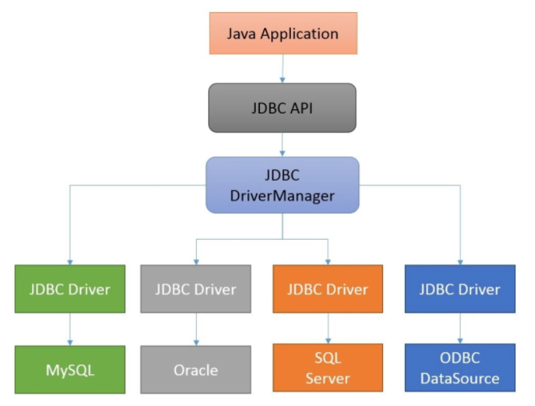
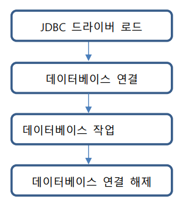
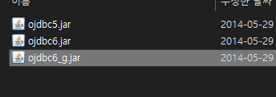
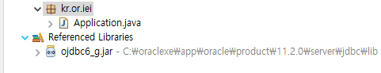
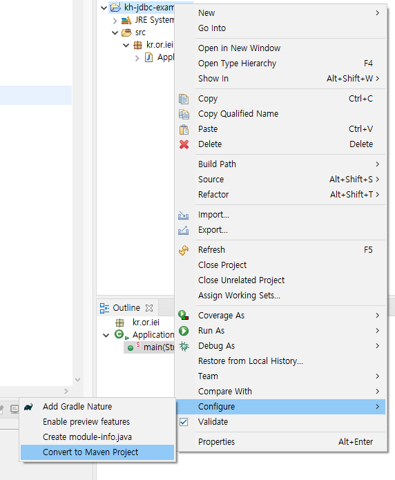
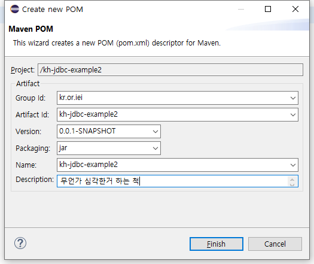

# 목차

- [목차](#목차)
- [1. JDBC(Java Database Connectivity)](#1-jdbcjava-database-connectivity)
- [2. JDBC 동작 단계](#2-jdbc-동작-단계)
- [3. 실습 환경 구축](#3-실습-환경-구축)
  - [3.1. 수동](#31-수동)
  - [3.2. 메이븐](#32-메이븐)
  - [3.3. 테스트 를! 할거에요](#33-테스트-를-할거에요)
- [4. JDBC 코드 구현 흐름](#4-jdbc-코드-구현-흐름)
  - [4.1. JDBC Driver 로드](#41-jdbc-driver-로드)
  - [4.2. 데이터베이스에 연결](#42-데이터베이스에-연결)
  - [4.3. 데이터베이스 작업](#43-데이터베이스-작업)
  - [4.4. 연결 끊기](#44-연결-끊기)
- [5. JDBC 객체](#5-jdbc-객체)
  - [5.1. DriverManager](#51-drivermanager)
  - [5.2. Connection](#52-connection)
  - [5.3. Statement vs PreparedStatement](#53-statement-vs-preparedstatement)
  - [5.4. ResultSet](#54-resultset)
- [6. CRUD 실습하기](#6-crud-실습하기)
  - [6.1. CREATE](#61-create)
  - [6.2. READ](#62-read)
  - [6.3. UPDATE](#63-update)
  - [6.4. DELETE](#64-delete)
  - [6.5. Transaction](#65-transaction)
  - [6.6. JDBC template](#66-jdbc-template)

# 1. JDBC(Java Database Connectivity)

JDBC는 자바 애플리케이션에서 DB에 접근할 수 있도록 하는 API이다.  



DMBS와 통신하여 DB의 기능을 사용하는 구현체는 각각 벤더의 jdbc Driver들이 가지고 있다. JDBC API는 `java.sql` 패키지에 위치하고 있다.  

# 2. JDBC 동작 단계



# 3. 실습 환경 구축

다음 두 가지 방법으로 진행하도록 하겠음

- 수동 설치
- 메이븐 설치

## 3.1. 수동

`Build Path` > `Add External Archives...` 선택


`ojdbc6_g.jar` 선택



Referenced Libraries에 등록되면 성공



## 3.2. 메이븐

`Configure` > `Convert to Maven Project` 선택



아티팩트 정보를 적어준다.  



의존성을 추가해준다.  

## 3.3. 테스트 를! 할거에요

```java
package kr.or.iei;

import java.sql.Connection;
import java.sql.DriverManager;
import java.sql.PreparedStatement;
import java.sql.ResultSet;
import java.sql.SQLException;

public class Application {

	public static void main(String[] args) throws ClassNotFoundException {
		System.out.println("ㅇㅅㅇ");
		Class.forName("oracle.jdbc.driver.OracleDriver");
		try (final Connection conn = 
				DriverManager.getConnection("jdbc:oracle:thin:@localhost:1521:XE", "system", "oracle")) {			
			final PreparedStatement pstmt = conn.prepareStatement("SELECT length('abcdbc') FROM dual");
			final ResultSet rs = pstmt.executeQuery();
			rs.next();
			System.out.println(rs.getInt(1));
			rs.close();
			pstmt.close();
			conn.close();
		} catch (SQLException e) {
			// TODO Auto-generated catch block
			e.printStackTrace();
		}
	}
}
```

# 4. JDBC 코드 구현 흐름

코드 흐름은 크게 다음과 같다.  

1. JDBC Driver 로드
2. 데이터베이스 연결
3. 데이터베이스 작업
4. 연결 종료

## 4.1. JDBC Driver 로드

```java
Class.forName("oracle.jdbc.driver.OracleDriver");
```

이렇게 하면 JVM에 클래스를 로드해줄 수 있다.  

## 4.2. 데이터베이스에 연결

JDBC url 형식을 보자.  

```text
jdbc:oracle:thin:[호스트이름]:[포트]:[db이름]
```

앞선 코드에선 다음과 같이 작성하였다.  

```java
jdbc:oracle:thin:@localhost:1521:XE
```

커넥션 객체를 얻기 위한 코드는 다음과 같다.  

```java
final Connection conn = DriverManager.getConnection(
    "jdbc:oracle:thin:@localhost:1521:XE",
    "id",
    "password"
);
```

## 4.3. 데이터베이스 작업

데이터베이스 작업을 하기 위해서는 다음 것들 중 하나가 필요하다.  

- Statement
- PreparedStatement

얻는 방법은 다음과 같다.  

```java
// statement
final Statement stmt = conn.createStatement();
stmt.executeQuery("SELECT 1 FORM dual");

// preparedstatement
final PreparedStatement pstmt = conn.prepareStatement("SELECT length('abcdbc') FROM dual");
pstmt.executeQuery();
```

쿼리를 수행하기 위한 메소드는 다음과 같다.  

|메소드 이름|반환 타입|설명|
|-|-|-|
|executeQuery|ResultSet: 쿼리 결과 객체|SELECT(DQL)를 실행한다.|
|executeUpdate|int: 영향 받은 row 개수|DML을 실행한다.|

뒤에서 다시 설명한다.  

## 4.4. 연결 끊기

앞서 얻었던 커넥션을 사용해 연결을 닫는다.  

```java
conn.close();
```

# 5. JDBC 객체

대표적으로 사용하는 친구들을 코드와 함께 집중적으로 정리해보자.  

- DriverManager
- Connection
- Statement vs PreparedStatement
- ResultSet

## 5.1. DriverManager

JDBC 드라이버 셋을 관리를 위한 기본 서비스 모듈. 벤더들이 제공한 적절한 드라이버를 찾아서 JDBC를 초기화 하는 역할을 수행한다.  

## 5.2. Connection

특정 DB에 대한 커넥션(세션)을 표현한다. 커넥션 컨텍스트 내에서 SQL 문이 실행되고 결과가 반환된다. 커넥션이 있어야 SQL 문 실행이 가능하다.  

## 5.3. Statement vs PreparedStatement

SQL을 실행하기 위해선 크게 다음 세 가지 절차가 필요하다.  

1. 쿼리 분석
2. 컴파일
3. 실행

Statement와 PreparedStatement의 차이는 바로 캐시에 있다. PreparedStatement는 단어에서 유추할 수 있듯 캐싱을 해둔다.  

|메소드 이름|반환 타입|설명|
|-|-|-|
|executeQuery|ResultSet: 쿼리 결과 객체|DQL를 실행한다.|
|executeUpdate|int: affected row(영향 받은 행) 개수|DML을 실행한다.|

## 5.4. ResultSet

DQL 수행 결과(executeQuery)를 담는 객체. 최초 반환 시 커서는 BOF에 위치해있고, 커서를 그 다음 칸으로 이동 시키는 메소드가 `next()`이다. next() 메소드의 반환 값은 EOF의 경우 false, 그 외에는 읽을 행이 남았다는 의미로 true이다.  

읽는 메서드는 get으로 시작하는 함수로 두 가지 종류가 있다.  

|파라미터|설명|
|-|-|
|getXXXX(int columnIdx)|칼럼 순서를 지정해서 값을 가져옴|
|getXXXX(String columnLabel)|칼럼 레이블 이름으로 값을 가져옴|

# 6. CRUD 실습하기

CRUD는 Create, Read, Update, Delete의 acronym이다.  
이름에서 유추할 수 있듯 CRUD는 각각 DB의 insert, select, update, delete에 해당한다.  

이 강의에서는 preparedStatement를 기준으로 설명한다. Statement와 같은 것들은 차이만 언급하거나 언급하지 않을 것임.  

## 6.1. CREATE

insert는 dml이므로 `executeUpdate` 메서드를 사용한다. insert를 하기 위해서 지정할 값들을 세팅해주어야 하는데 다음 snippet을 보자.  

```java
// statement
final String sqlFormat = "INSERT INTO jdbc_data VALUES(seq_jdbc_data_pk.nextval, '%s', '%s')";
final String username = "Chiho Won";
final String userMail = "a@b.com";
final String sql = String.format(sqlFormat, username, userMail);
final Statement statement = conn.createStatement();
statement.executeUpdate(sql);

// prepared statement
final String username = "Chiho Won";
final String userMail = "a@b.com";
final String sql = "INSERT INTO jdbc_data VALUES(seq_jdbc_data_pk.nextval, ?, ?)";
final PreparedStatement pstmt = conn.prepareStatement(sql);
pstmt.setString(1, username);
pstmt.setString(2, userMail);
final int affectedRows = pstmt.executeUpdate();
```

PreparedStatement는 Statement의 경우와 달리 SQL 문장을 전체 모두 써주어야 할 필요 없이 값이 들어갈 위치에 `?` 기호를 사용한다.  
그리고 순서에 따라 `setXXXXX` 메소드로 값을 지정해준다.  

## 6.2. READ

select의 결과는 단일행과 복수행이 있을 수 있다. pk나 unique 컬럼을 조건으로 하면 단일 행만 결과로 출력되며, 그 외에는 복수행이 올 수 있다.  

select는 `executeQuery` 메소드를 사용한다고 앞서 소개했다. 이 메서드가 호출되고 나서 흐름을 이해해야한다.  

1. `executeQuery`를 호출하고 ResultSet이 반환됨
2. ResultSet은 BOF를 가리키고 있음
3. `next()`를 호출하면 결과셋에서 커서가 그 다음 행을 가리키고 반환 값은 true임
4. 다 읽게되면 EOF를 가리키고 next()는 false를 반환함

이제 snippet을 보자.  

```java
rs.next();  // 다음 행으로 이동
final long id = rs.getLong("id");
final String name = rs.getString("name");
final String email = rs.getString("email");
final LocalDateTime time = rs.getTimestamp("time").toLocalDateTime();
```

## 6.3. UPDATE

executeUpdate를 사용해서 CREATE 예제와 다를 것이 sql 문장 제외하곤 없다.  

```java
final String sql = "UPDATE jdbc_data SET name = ? WHERE id = ?";
final PreparedStatement pstmt = conn.prepareStatement(sql);
pstmt.setString(1, "java");
pstmt.setLong(2, 22);
final int affectedRows = pstmt.executeUpdate();
System.out.println(affectedRows);
```

## 6.4. DELETE

```java
final String sql = "DELETE FROM jdbc_data WHERE id = ?";
final PreparedStatement pstmt = conn.prepareStatement(sql);
pstmt.setLong(1, 21);
final int affectedRows = pstmt.executeUpdate();
System.out.println(affectedRows);
```

## 6.5. Transaction

커넥션 객체의 컨텍스트 내에서 트랜잭션 제어(commit, rollback, savepoint)를 할 수 있다.  

그 중 대표적으로 쓸만한 메소드는 다음과 같다.  

|메소드|설명|
|-|-|
|commit()|커밋|
|rollback()|롤백|
|setAutoCommit(boolean)|자동 커밋 설정. true - 자동 false - 수동|
|getAutoCommit()|현재 자동 커밋 설정 상태|

## 6.6. JDBC template

JDBC 공통 모듈을 만들어보자.  

