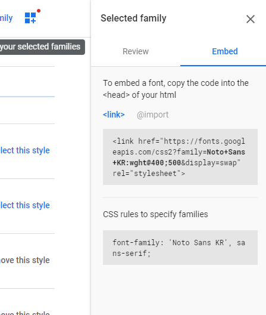
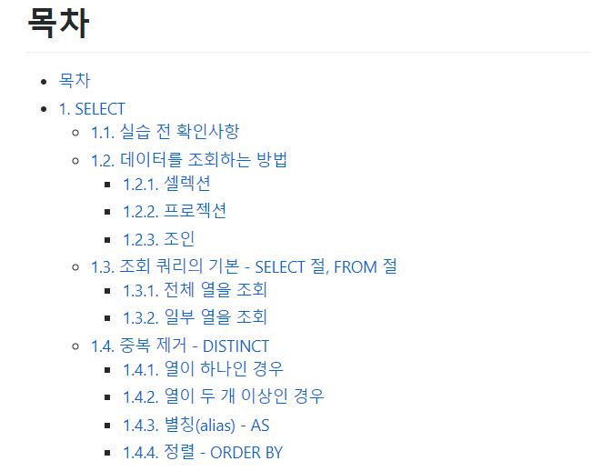

# 목차

- [목차](#목차)
- [1. 폰트 관련 스타일](#1-폰트-관련-스타일)
  - [1.1. 폰트 지정](#11-폰트-지정)
  - [1.2. 폰트 크기](#12-폰트-크기)
  - [1.3. 폰트 굵기](#13-폰트-굵기)
- [2. 텍스트 스타일](#2-텍스트-스타일)
  - [2.1. 텍스트 색상](#21-텍스트-색상)
  - [2.2. 텍스트 장식](#22-텍스트-장식)
  - [2.3. 텍스트 변환](#23-텍스트-변환)
  - [2.4. 텍스트 그림자](#24-텍스트-그림자)
  - [2.5. 텍스트 공백](#25-텍스트-공백)
  - [2.6. 자간](#26-자간)
- [3. 문단](#3-문단)
  - [3.1. direction](#31-direction)
  - [3.2. text-align](#32-text-align)
  - [3.3. text-justify](#33-text-justify)
  - [3.4. text-indent](#34-text-indent)
  - [3.5. line-height](#35-line-height)
  - [3.6. text-overflow](#36-text-overflow)
- [4. 목록](#4-목록)
  - [4.1. ul - 불릿 스타일 지정](#41-ul---불릿-스타일-지정)
  - [4.2. ol - 숫자 스타일 지정](#42-ol---숫자-스타일-지정)
  - [4.3. ul에 이미지 넣기](#43-ul에-이미지-넣기)
  - [4.4. emoji 넣기](#44-emoji-넣기)

# 1. 폰트 관련 스타일

cheat sheet

|속성명|설명|
|-|-|
|font-family|폰트 지정|
|@font-face|웹 폰트 지정|

## 1.1. 폰트 지정

```html
<style>
    * {
        font-family: <font_name> [, <font_name...>]
    }
</style>
```

폰트를 지정하며 여러가지 폰트를 지정할 수 있다. 시스템에 있는 폰트를 사용한다. css3 이후로는 웹 폰트가 대세임.

웹 폰트는 `@font-face`를 사용한다.  
폰트는 다음 사이트에서 골라서 사용하면 된다.  

https://fonts.google.com/

Noto Sans를 골라보자.  



친절하게 코드에서 어떻게 사용해야하는지도 알려준다.  

```html
<style>
@import url('https://fonts.googleapis.com/css2?family=Noto+Sans+KR:wght@400;500&display=swap');

p {
    font-family: 'Noto Sans KR', sans-serif;
}
</style>
```

폴백 폰트

## 1.2. 폰트 크기

```html
font-size: 절대크기 | 상대크기 | 크기 | 백분율
```

폰트 단위는 다음과 같다.  

|단위|설명|
|-|-|
|em|글꼴의 대문자 M 너비 기준으로 크기를 조정|
|rem|문서 기준|
|px|픽셀 단위. 모니터 영향 받음.|

대표적으로 많이 사용하는 것들은 em, rem, px이다. 그래서 다른 친구들은 그냥 생략.  

## 1.3. 폰트 굵기

```html
font-weight: 값
```

|속성 값|설명|
|-|-|
|normal|디폴트|
|bold/lighter/bolder|굵게/가늘게/더 굵게|
|100 ~ 700|400이 normal.|

# 2. 텍스트 스타일

폰트는 텍스트의 생김새 즉, 글꼴에 대한 것이였고 여기서는 텍스트 스타일임.  

## 2.1. 텍스트 색상

```html
color: <색상 혹은 색상값>
```

## 2.2. 텍스트 장식

```html
text-decoration: none | underline | overline | line-through
```

|속성 값|설명|
|-|-|
|none|밑줄 표시 안함(디폴트)|
|underline|밑줄 표시|
|overline|윗선 표시|
|line-through|취소선 표시|

## 2.3. 텍스트 변환

```html
text-transform: none | capitalize | uppercase | lowercase | full-width
```

|속성 값|설명|
|-|-|
|none|변환 안함(디폴트)|
|capitalize|첫 글자 대문자 변환|
|uppercase|모든 글자 대문자|
|lowercase|모든 글자 소문자|
|full-width|전각 문자 (지원하는 폰트만)|

## 2.4. 텍스트 그림자

```html
text-shadow: <offset-x> <offset-y> <blur-radius> <color>
```

다음과 같이 해보자.  

```html
<style>
    .caption {
        color: #127cc1;
        text-shadow: 5px 5px 3px #999999;
    }
</style>

<h1 class="caption">Live Server Test</h1>
```

## 2.5. 텍스트 공백

```html
white-space: normal | nowrap | pre | pre-line | pre-wrap
```

|속성 값|설명|
|-|-|
|none|기본 값. 연속 공백을 하나로 합침.|
|nowrap|연속 공백을 하나로 합침. 줄 바꿈은 `<br>` 요소에서만|
|pre|연속 공백 유지. 줄 바꿈은 개행 문자와 `<br>` 요소에서만|
|pre-line|연속 공백을 하나로 합침. 줄바꿈은 개행 문자와 `<br>` 요소에서 일어나며, 한 줄이 너무 길어서 넘칠 경우 자동으로 개행.|
|pre-wrap|연속 공백 유지. 줄 바꿈은 개행 문자와 `<br>` 요소에서 일어나며, 한 줄이 너무 길어서 넘칠 경우 자동 개행|

## 2.6. 자간

글자 간 공백, 문자 간 공백

```html
letter-spacing
word-spacing
```

# 3. 문단

문단의 속성에 대해 정리해보자.  

## 3.1. direction

텍스트의 방향을 지정한다. ltr(기본), rtl이 존재한다.  

```html
direction: ltr
```

## 3.2. text-align

텍스트 정렬

```html
text-align : 속성값
```

|속성 값|설명|
|-|-|
|start|현재 텍스트 줄 시작 위치에 맞추어 문단 정렬(ltr, rtl)|
|end|현재 텍스트 줄 끝 위치에 맞추어 문단 정렬(ltr, rtl)|
|left|왼쪽 맞춤|
|right|오른쪽 맞춤|
|center|가운데 맞춤|
|justify|양쪽에 맞춤|
|match-parent|부모 요소를 따라 문단 정렬|

## 3.3. text-justify

정렬 시 공백 조절

```html
text-justify: 속성값
```

|속성 값|설명|
|-|-|
|auto|브라우저가 자동 설정|
|none|정렬 지정 안함|
|inter-word||
|distribute|인접한 글자 간 공백을 동일하게 맞추어서 정렬|

## 3.4. text-indent

들여쓰기

```html
text-indent: 크기 단위(혹은 백분율)
```

## 3.5. line-height

```html
line-height: normal | <숫자> | <크기> | <백분율> | inherit
```

## 3.6. text-overflow

텍스트 넘치는 것을 어떻게 처리할 지 결정하는 속성

```html
text-overflow: clip | ellipsis
```

기본 값은 clip으로 영역을 넘어가면 잘라버린다. 하지만 ellipsis는 줄임표를 사용한다.  

# 4. 목록

목록은 다음과 같은 친구들을 의미한다.  



이를 위한 태그가 ul(ol), li가 있었다. 이 친구들을 위한 스타일이 다음과 같다.  

## 4.1. ul - 불릿 스타일 지정

ul(unordered list)의 경우 bullet의 스타일을 지정할 수 있다.  

```html
line-style-type: 속성 값
```

|속성값|설명|
|-|-|
|disc|●|
|circle|○|
|square|■|
|none||

## 4.2. ol - 숫자 스타일 지정

ol(ordered list)의 경우 숫자 스타일을 지정할 수 있다.  

```html
line-style-type: 속성 값
```

|속성값|설명|
|-|-|
|decimal|1, 2, ...|
|decimal-leading-zero|01, 02, ...|
|lower-roman|i, ii, ...|
|upper-roman|I, II, ...|
|lower-alpha|a, b, ...|
|upper-alpha|A, B, ...|

## 4.3. ul에 이미지 넣기

순서 없는 리스트에서 이미지를 넣을 수도 있다.  

```html
line-style-image: url(이미지주소)
```

## 4.4. emoji 넣기

응용해서 이모지를 넣어보자.  

```html
<style>
    .fancy-list {
        list-style: none;
        padding: 0;
        margin: 0;
    }

    .fancy-list > li {
        padding-left: 1rem;
        text-indent: -0.7rem;
    }

    .fancy-list > li:before {
        content: "👀";
    }
</style>
```
