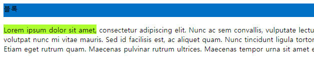

# 목차

- [목차](#목차)
- [1. CSS 박스 모델](#1-css-박스-모델)
  - [1.1. 블록 레벨 요소와 인라인 요소](#11-블록-레벨-요소와-인라인-요소)
  - [1.2. 박스 모델](#12-박스-모델)
  - [1.3. width, height](#13-width-height)
  - [1.4. display](#14-display)
    - [1.4.1. block](#141-block)
    - [1.4.2. inline](#142-inline)
    - [1.4.3. inline-display](#143-inline-display)
    - [1.4.4. none](#144-none)
- [2. 테두리(border)](#2-테두리border)
  - [2.1. border-style](#21-border-style)
  - [2.2. border-width](#22-border-width)
  - [2.3. border-color](#23-border-color)
  - [2.4. border](#24-border)
  - [2.5. border-radius](#25-border-radius)
- [3. 패딩(padding)](#3-패딩padding)
- [4. 마진(margin)](#4-마진margin)

# 1. CSS 박스 모델


브라우저 화면에 그려지는 친구들은 모두 이 박스라고 생각하면 간단하다.  

## 1.1. 블록 레벨 요소와 인라인 요소

이미 앞서 언급했지만 이번엔 제대로 정리를 해보자.  

```html
<head>
    <style>
        .block-box {
            width: 100%;
            height: 30px;
            background-color: #0071c5;
        }

        .inline-box {
            background-color: greenyellow;
        }
    </style>
</head>
<body>
    <div class="block-box">블록</div>
    <p>
        <span class="inline-box">Lorem ipsum dolor sit amet,</span> consectetur adipiscing elit. Nunc ac sem convallis, vulputate lectus ut, euismod mauris. Cras sed suscipit quam, nec imperdiet mauris. Aenean pulvinar vitae mi eu aliquet. Aenean non ligula risus. Sed pretium, sapien et vulputate luctus, neque dui porta velit, id volutpat nunc mi vitae mauris. Sed id facilisis est, ac aliquet quam. Nunc tincidunt ligula tortor, vel mollis arcu accumsan ultricies. Nam ipsum erat, aliquam quis nunc quis, maximus condimentum est. Nunc non elementum tortor. In nunc arcu, volutpat vel nibh vitae, sodales pulvinar enim. Etiam eget rutrum quam. Maecenas pulvinar rutrum ultrices. Maecenas tempor urna sit amet erat luctus, bibendum semper tellus mollis. Suspendisse mattis finibus turpis sed convallis. Duis non lorem neque.
    </p>
</body>
```



## 1.2. 박스 모델


박스는 다음과 같이 구성되어 있다.  

- 콘텐츠 영역
- 패딩(padding): 테두리(border)와 콘텐츠의 경계 여백
- 테두리(border): 박스 테두리
- 마진(margin): 다른 박스와의 여백

## 1.3. width, height

width(너비), height(높이)는 컨텐츠 영역의 크기를 지정하는 속성이다.  
지정할 수 있는 크기 값은 다음과 같다.  

|값|설명|
|-|-|
|크기|px, cm, rem 등|
|백분율|퍼센테이지|
|auto|기본 값. 컨텐츠 영역의 양에 따라 알아서 결정됨|

유의해야 할 점은 width, height는 앞서 언급한 바와 같이 컨텐츠 영역의 크기만 나타낸다. 실제 너비는 좌우 border와 좌우 padding까지 고려해야 한다.  

```text
실제 너비: width + 좌우 padding + 좌우 border
```

## 1.4. display

태그를 블록이나 인라인으로 변경할 수 있는 속성이다.  

### 1.4.1. block

img 태그는 인라인 태그이다. 따라서 사진은 부모 박스의 영역이 허용하는 한도 내에서 한 줄에 이어진다. 이를 block으로 바꿔보자.  

```html
<style>
    img {
        display: block;
    }
</style>
```

### 1.4.2. inline

그럼 반대로 블록인 div 박스를 inline으로 만들어보자.  

```html
<style>
    .box {
        width: 100px;
        height: 100px;
        display: inline;
    }
</style>
```

하지만 예상대로는 되지 않을 것이다. 한 줄로는 배치할 수 있지만 너비, 높이, 마진 등의 박스 모델 값이 적용이 안된다.  

### 1.4.3. inline-display

요소는 인라인으로 배치하면서 내용은 블록 레벨로 지정하고 싶다면 사용하는 속성이 바로 이것임.  

### 1.4.4. none

none을 사용하면 아예 화면에 그리지 않는다. 비슷한 속성으로 `visibility: hidden`이 있는데 결정적인 차이점은 `visibility`는 화면에서 감추지만 원래 요소가 차지하는 공간은 그대로 있고 `display`는 완전히 사라진다.  

# 2. 테두리(border)

박스 영역의 테두리에 해당하는 속성인 border에 대해 알아보자.  

## 2.1. border-style

테두리 스타일을 지정할 수 있다. 기본적으로 이 값은 none이다.  

|속성 값|설명|
|-|-|
|none|테두리 없음. 기본값|
|hidden|테두리 표시 안함|
|solid|직접 실행|
|dashed|직접 실행|
|dotted|직접 실행|
|double|직접 실행|

## 2.2. border-width

테두리의 두께를 지정할 수 있다. 속성 값은 다음과 같이 지정할 수 있다.  

```html
<style>
    p {
        /* 일괄 적용 */
        border-width: 값;

        /* 시계 방향 */
        border-width: top값 right값 bottom값 left값;

        /* 위아래 좌우 */
        border-width: (top-bottom 동시지정) (left-right 동시지정);
    }
</style>
```

## 2.3. border-color

테두리 색상 지정

## 2.4. border

```html
<style>
    p {
        border: 두께 색상 스타일;
    }
</style>
```

## 2.5. border-radius

박스 모서리 둥글게 깎기

# 3. 패딩(padding)

컨텐츠 영역과 테두리 사이의 공간을 padding이라고 부른다.  

# 4. 마진(margin)

테두리 밖의 공간에 대한 속성이 margin이다.  

