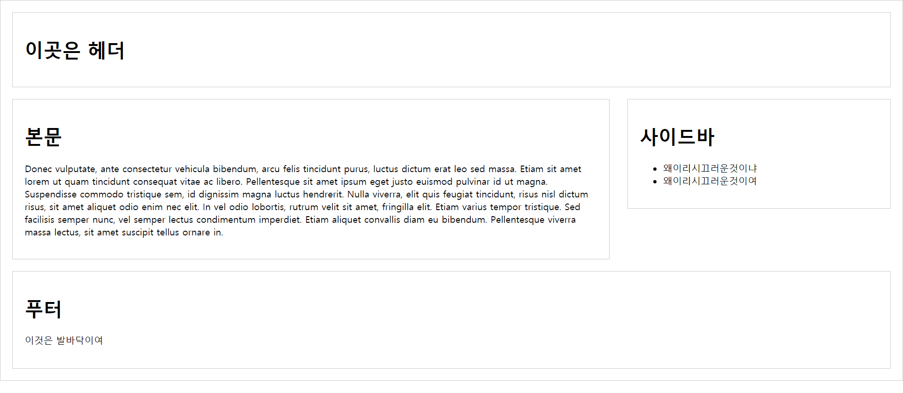
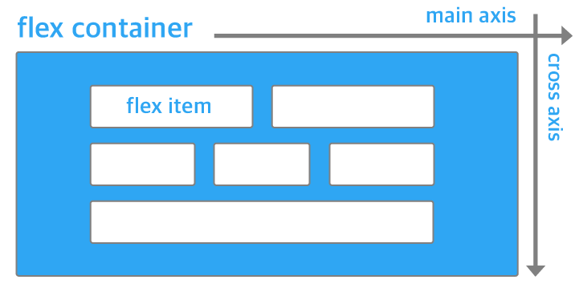

# 목차

- [목차](#목차)
- [1. 레이아웃 기초](#1-레이아웃-기초)
  - [1.1. box-sizing](#11-box-sizing)
  - [1.2. float](#12-float)
  - [1.3. clear](#13-clear)
  - [1.4. 실습](#14-실습)
  - [1.5. position 속성](#15-position-속성)
    - [1.5.1. static](#151-static)
    - [1.5.2. relative](#152-relative)
    - [1.5.3. absolute](#153-absolute)
    - [1.5.4. fixed](#154-fixed)
- [2. flexible box](#2-flexible-box)
  - [2.1. 용어 정리 / 속성 정리](#21-용어-정리--속성-정리)
    - [2.1.1. 기본 용어](#211-기본-용어)
    - [2.1.2. flex container의 속성](#212-flex-container의-속성)
    - [2.1.3. flex item 속성](#213-flex-item-속성)
  - [2.2. 실습ㄱㄱ](#22-실습ㄱㄱ)
    - [2.2.1. 플렉스 방향 지정](#221-플렉스-방향-지정)
    - [2.2.2. 플렉스 배치 지정](#222-플렉스-배치-지정)
    - [2.2.3. 방향과 배치를 한 번에 지정](#223-방향과-배치를-한-번에-지정)
    - [2.2.4. flex item의 flex 속성의 이해](#224-flex-item의-flex-속성의-이해)

# 1. 레이아웃 기초

앞서 CSS로 스타일을 주어 화려한 효과를 부여해봤다. 하지만 진짜 역할은 CSS로 레이아웃을 잡는데 있다.  

## 1.1. box-sizing

box-sizing은 너비의 기준을 결정하는 속성이다.  

|속성 값|설명|
|-|-|
|content-box|width 속성값을 컨텐츠 영역의 너비로 지정함. 기본 값|
|border-box|width 속성값을 마진을 제외한 컨텐츠, 패딩, 테두리까지 포함해서 너비로 사용|

```html
<head>
    <title>케케..</title>
    <style>
        .box {
            width: 300px;
            height: 300px;
            margin: 10px;
            padding: 20px;
            border: 3px solid red;
        }

        .content-box {
            background-color: #002f9c;
            box-sizing: content-box;
        }

        .border-box {
            background-color: aquamarine;
            box-sizing: border-box;
        }
    </style>
</head>
<body>
    <div class="box content-box"></div>
    <div class="box border-box"></div>
</body>
```

## 1.2. float

단어 그대로 떠있도록 만드는 속성이다. 방향은 right, left, none을 줄 수 있다.  

```html
<style>
    .container {
        position: absolute;
        width: 50%;
        background-color: black;
    }

    .box {
        width: 100px;
        height: 100px;
        box-sizing: border-box;
    }

    .red {
        background-color: red;
    }

    .blue {
        background-color: blue;
    }

    .green {
        background-color: green;
    }

    .yellowgreen {
        background-color: yellowgreen;
    }

    .box-left {
        float: left;
    }

    .box-right {
        float: right;
    }
</style>

<div class="container">
    <div class="box box-left red"></div>
    <div class="box box-left blue"></div>
    <div class="box box-left green"></div>
    <div class="box box-right yellowgreen"></div>
</div>
```

직관적으로 확인해볼 수 있다.  

## 1.3. clear

float 속성은 다음 오는 요소에게도 속성이 전파되는데, clear를 사용해서 무효화 시킬 수 있다. float: left로 배치된 요소 다음에 오는 경우 clean: left로 지우면 된다.  

그냥 싹 지우려면 `clear: both`도 가능하다.  

## 1.4. 실습



모든 div에 대해서는 다음과 같은 속성을 줌

- 실선 테두리
- 실선 두께 1px
- 테두리와 컨텐츠 사이의 여백 20px
- 다른 박스와의 간격 20px

본문

- 폭은 전체의 68%

사이드바

- 폭은 전체의 30%

## 1.5. position 속성

박스의 위치를 결정하는 속성 4가지를 보자.  

- top
- bottom
- left
- right

이 속성들에 크기 값을 주면 해당 기준으로부터 떨어진 거리에 box를 그린다.  

정말 그런지 살펴보자.  

### 1.5.1. static

position의 default는 static이다. 별도로 position을 지정하지 않았다면 이 속성값으로 동작하며 우리가 지금까지 봤던 그대로 동작한다.  

인라인은 쭉 같은 줄에 영역만 넘지 않는다면 배치할 수 있고 블록은 개행이 발생된다.  

### 1.5.2. relative

다른 블록의 배치에 따라 상대적으로 배치된다.  

### 1.5.3. absolute

절대적인 위치에 배치한다.  

이 때 기준은 가장 가까운 부모의 박스나 조상 요소 중 속성이 relative인 요소를 기준으로 한다.  

### 1.5.4. fixed

absolute와 비슷해보이지만 이 속성은 기준이 부모 요소가 아니라 브라우저 창이 기준이 된다.  

# 2. flexible box

레이아웃에 가장 많이 사용하는 기능이 바로 `flexible box`이다. 레이아웃을 잡기도 쉽고 반응형을 고려하기도 편하기 때문에 별 문제 없다면 flex를 쓰는 것을 고려하자!  

## 2.1. 용어 정리 / 속성 정리

다음 그림을 기준으로 용어를 우선 정리해보자.  



### 2.1.1. 기본 용어

|용어|설명|
|-|-|
|flex container(컨테이너)|컨테이너로 묶어 주어야 배치된 항목들을 사용할 수 있다.|
|flex item(항목)|컨테이너 안의 흰색 사각형이 모두 항목이다. 요소가 여기에 해당된다.|
|main axis(주축)|항목을 배치하는 기본 방향으로 수평 ltr이 기본이다.|
|cross axis(교차축)|주축에 직교하는 방향으로 수직으로 위에서 아래로 배치된다.|

당연히 축은 배치 방향에 따라 시작점과 끝점이 있으니 이 사실을 기억하자.  

### 2.1.2. flex container의 속성

|속성명|설명|
|-|-|
|flex-direction|플렉스 방향 지정|
|flex-wrap|배치 방식 지정|
|justify-content|주축을 기준으로 항목 배치 방식 지정|
|align-items|교차축을 기준으로 항목 배치 방식 지정|
|align-content|여러 줄일 때의 배치 방식 지정|

### 2.1.3. flex item 속성

|속성명|설명|
|-|-|
|flex|플렉스 항목 크기 조절|
|order|플렉스 항목 배치 순서 변경|

flex 속성의 기본 사용 형식은 다음과 같다.  

```html
flex: [(flex-grow) (flex-shrink) (flex-basis)] | auto | initial
```

- flex-grow: 항목의 너비를 얼마나 늘릴지 숫자로 지정
- flex-shrink: 항목의 너비를 얼마나 줄일지 숫자로 지정
- flex-basis: 항목의 기본 크기 지정

## 2.2. 실습ㄱㄱ

간단하게 실습을 해보자.  

### 2.2.1. 플렉스 방향 지정

플렉스 컨테이너에서 사용할 수 있는 속성인 flex-direction을 사용한다.  

- row: 주축을 가로로, 교차축을 세로로 지정. Left to Right
- row-reverse: 주축을 가로로, 교차축을 세로로 지정. Right to Left
- column: 주축을 세로로, 교차축을 가로로 지정. top to bottom
- column-reverse: 주축을 세로로, 교차축을 가로로 지정. bottom to top

### 2.2.2. 플렉스 배치 지정

flex-wrap 속성을 사용한다.  

- no-wrap: 한 줄에 욱여넣음
- wrap: 여러 줄에 걸쳐 표시
- wrap-reverse: 근데 반대임

### 2.2.3. 방향과 배치를 한 번에 지정

flex-flow: 방향 배치

### 2.2.4. flex item의 flex 속성의 이해

flex 속성은 3가지로 구분된다.  

