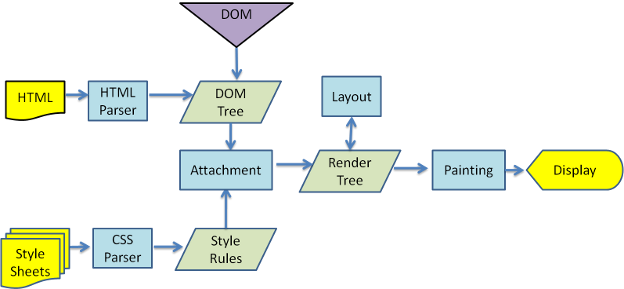

# 목차

- [목차](#목차)
- [Intro.](#intro)
- [1. 주소를 입력해서 화면에 그려지기 까지](#1-주소를-입력해서-화면에-그려지기-까지)
- [2. 화면에 그리기](#2-화면에-그리기)
  - [2.1. HTML과 DOM](#21-html과-dom)
  - [2.2. CSS와 CSSOM](#22-css와-cssom)
  - [2.3. 렌더 트리](#23-렌더-트리)
  - [2.4. reflow & repaint](#24-reflow--repaint)
- [4. script의 위치는 중요한가?](#4-script의-위치는-중요한가)
  - [4.1. 이를 위한 개선](#41-이를-위한-개선)
- [5. DOM(Document Object Model)](#5-domdocument-object-model)
  - [5.1. 노드](#51-노드)
- [6. DOM 제어](#6-dom-제어)
  - [6.1. 요소 노드 찾기](#61-요소-노드-찾기)
    - [6.1.1. id로 찾기](#611-id로-찾기)
    - [6.1.2. class로 찾기](#612-class로-찾기)
    - [6.1.3. 태그 이름으로 찾기](#613-태그-이름으로-찾기)
    - [6.1.4. getElementBy의 문제점](#614-getelementby의-문제점)
  - [6.2. DOM 순회](#62-dom-순회)
  - [6.3. DOM 조작](#63-dom-조작)

# Intro.

브라우저에서의 렌더링 과정과 자바스크립트를 이용한 제어에 대해 정리한다.  




서버에서 받은 html, css, javascript등을 파싱해서 렌더링 해주는 것이 브라우저의 핵심 역할이다.  

> 1. 파싱  
> 특정한 문법의 텍스트를 읽어서 tokenizing, lexing을 통해 parse tree를 생성하는 과정을 의미한다. 이 파싱의 결과물인 parse tree를 중간 언어로 변환 후 실행한다.  
> 2. 렌더링  
> 파싱된 결과물을 해석하여 브라우저에 그려줌

# 1. 주소를 입력해서 화면에 그려지기 까지

우선 간단하게 접속 과정을 정리해보자.  

1. https://google.com/ 주소를 입력
2. 로컬 머신에 등록된 DNS의 IP에 질의
   1. 해당 DNS에 정보가 캐싱 된 경우 바로 응답
   2. 캐싱되어 있지 않다면 상위 DNS에게 질의
3. DNS로부터 응답 받은 IP로 TCP 커넥션 시도
4. TCP 커넥션이 완료되면 서버에게 리소스를 요청(`HTTP`)하고 응답 받음
5. 응답으로 받은 html 파일을 브라우저가 렌더링
   1. 추가로 필요한 리소스가 있다면 다시 1번부터 4번까지 과정 반복

이렇게 리소스를 받고 나면 브라우저는 다음과 같은 과정을 거친다.  


1. 브라우저의 렌더링 엔진이 응답으로 받은 리소스인 html과 css를 파싱해 각각 DOM과 CSSOM을 생성하고 렌더 트리를 생성
2. 렌더 트리를 바탕으로 HTML 요소(element)의 레이아웃(layout)을 계산하고 화면에 그린다(painting)

추가적으로 자바스크립트는 DOM API를 이용해 DOM과 CSSOM을 변경할 수 있고 렌더 트리가 변경되면 다시 그린다.  

# 2. 화면에 그리기

## 2.1. HTML과 DOM

서버에서 보내온 HTML 파일

```html
<!DOCTYPE html>
<html>
  <head>
    <meta name="viewport" content="width=device-width,initial-scale=1">
    <link href="style.css" rel="stylesheet">
    <title>Critical Path</title>
  </head>
  <body>
    <p>Hello <span>web performance</span> students!</p>
    <div></div>
  </body>
</html> 
```


## 2.2. CSS와 CSSOM

서버에서 보내온 CSS 파일

```css
body { font-size: 16px }
p { font-weight: bold }
span { color: red }
p span { display: none }
img { float: right } 
```


## 2.3. 렌더 트리

각각 생성된 DOM과 CSSOM은 렌더 트리로 결합된다.  


렌더 트리는 레이아웃 계산과 페인팅을 위해 입력된다.  

## 2.4. reflow & repaint

레이아웃 계산과 페인팅은 다음과 같은 이유로 재실행 된다.  

- 자바스크립트에 의한 노드 생성/삭제
- 뷰 포트 사이즈 변경
- 레이아웃과 관련된 스타일 변경

reflow: 레이아웃을 재계산
repaint: 렌더링을 다시 함

바로 앞서 언급한 원인에 의해 reflow와 repaint가 발생하며 코스트가 큰 연산이다.  

# 4. script의 위치는 중요한가?  

- DOM이 미처 파싱 되기 전에 DOM API를 사용하면 문제가 될 수 있음
- 블로킹 됨

## 4.1. 이를 위한 개선

이런 문제를 개선하기 위해 HTML5부터 script 태그에 async와 defer 속성이 추가되었다.  

async와 defer는 외부 자바스크립트 파일을 로드하는 경우에만 사용할 수 있다. 즉 내부적으로 선언한 script에서는 불가능하다는 뜻이다.  

- async: HTML 파싱과 자스 파일이 비동기적으로 동시에 진행된다. 다만 자스 파일이 로드되면 실행되기 때문에 HTML 파싱이 중단된다. 즉, 순서가 필요한 경우(동기적) 사용하는 것은 비권장
- defer: DOM 생성 직후(DOMContentLoaded)에 진행된다. DOM 생성 후 실행되어야 할 스크립트에 사용하자.  

# 5. DOM(Document Object Model)

DOM은 브라우저를 위한 자료구조로, 계층(트리) 구조로 되어 있다. 또한 이를 조작하기 위한 API를 DOM API라고 부른다.  

## 5.1. 노드

HTML문서의 개별적 요소를 HTML 요소(element)라고 부른다. 쉽게 생각해서 태그, 속성(attribute)과 값, 콘텐츠를 의미한다.  

```html
<a href='/images/dog'>멍멍이사진</a>
```

태그는 요소 노드로, 속성과 값은 속성 노드로 들어간다. 또한 콘텐츠는 텍스트 노드로 들어간다.  


DOM 트리는 노드로 구성되어 있고 다음과 같이 최상위에 document라는 노드가 존재한다. 노드의 종류를 정리해보자.  

1. document
   1. DOM 트리의 최상위에 있는 노드이다. HTML 문서당 document 객체는 유일하다. 자바스크립트 전역객체 windows의 document 프로퍼티에 바인딩 되어 있다.  
2. element: HTML 요소
3. attribute: HTML 요소의 속성과 값
4. text: 텍스트

# 6. DOM 제어

이제 자바스크립트를 이용해 DOM을 제어해보자.  

## 6.1. 요소 노드 찾기

요소 노드를 찾을 수 있는 대표적인 방법은 다음과 같다.  

- id 속성
- class 속성
- 태그 이름

### 6.1.1. id로 찾기

id는 킹론적으로 문서 내에서 유일하다.  

```javascript
const countryCode = document.getElementById('country-code')
```

### 6.1.2. class로 찾기

class는 여러 친구가 올 수 있다.  

```javascript
const l = document.getElementsByClassName('style-scope')
```

### 6.1.3. 태그 이름으로 찾기

태그 역시 여러 친구가 올 수 있다.  

```javascript
const e = document.getElementsByTagName('div')
```

### 6.1.4. getElementBy의 문제점

`HTMLCollection` 객체를 반환하는데, 요소의 변화에 실시간으로 영향을 받기 때문에 이를 이용해서 요소를 조작하면 사이드 이펙트가 발생할 가능성이 높다.  

따라서 non-live인 NodeList를 사용하는 것이 방법인데 이를 위해서는 쿼리 셀렉터를 사용하는 것을 추천한다.  

```javascript
querySelector('#id-to-find')
querySelectorAll('div')
```

## 6.2. DOM 순회

- childNodes
- children
- firstChild
- lastChild
- firstElementChild
- lastElementChild
- parentNode
- previousSibling
- previousElementSibling
- nextSibling
- nextElementSibling

## 6.3. DOM 조작

- innerHTML
- DOMPurify.sanitize
- createElement
- appendChild
- createTextNode