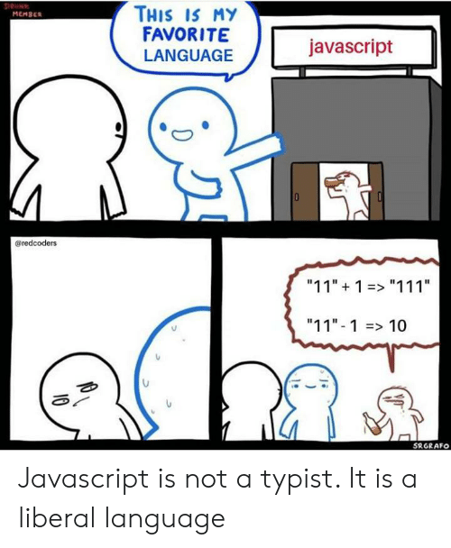

# 목차

- [목차](#목차)
- [Intro.](#intro)
- [1. 비교 연산자](#1-비교-연산자)
- [2. 지수 연산자](#2-지수-연산자)
- [3. 비구조화 할당](#3-비구조화-할당)
- [4. 그 외](#4-그-외)

# Intro.

다 다루기엔 중복이 많으므로 자바와의 차이점을 중심으로 기술한다.  

# 1. 비교 연산자



자바스크립트에서 값을 정확하게 비교하려면 `===`를 사용해야 한다.  

자바스크립트의 동등 비교 연산(`==`)은 다음과 같은 과정을 거친다.  

- 좌항과 우항의 피연산자를 묵시적 타입변환 시킨다
- 그리고 비교

따라서 일치 비교 연산(`===`)을 사용해야한다. 일치 비교 연산은 좌항과 우항의 피연산자 타입이 일치해야하고 값도 같아야 true를 반환한다.  

# 2. 지수 연산자

ES7+ 문법으로 멱승을 계산한다.  

```javascript
2 ** 3
2 ** 0
2 ** -2
2 ** 2.5
```

# 3. 비구조화 할당

```javascript
const user = {
    id: 'ae158d0e-0df5-4fb7-a48e-f19f5fc65f1b',
    cart: ['포도', '오렌지', '사과'],
    email: 'a@b.com'
}

const {id, cart, email} = user;
```

# 4. 그 외

|연산자|설명|
|-|-|
|new|생성자 함수 호출|
|delete|프로퍼티 제거|
|in|프로퍼티 존재 검사|
|?.|옵셔널 체이닝|
|??|null 병합|