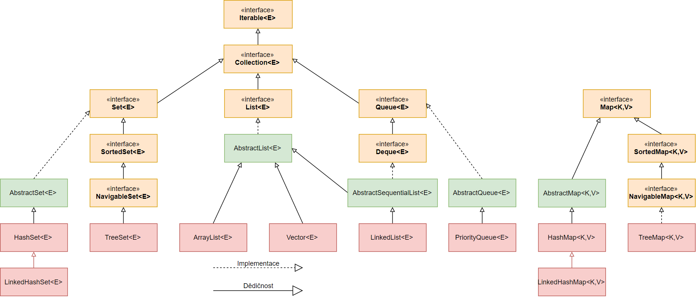

# 목차

- [목차](#목차)
- [1. 컬렉션 프레임워크](#1-컬렉션-프레임워크)
- [2. 주요 인터페이스](#2-주요-인터페이스)
- [3. Set\<E\>](#3-sete)
- [4. List\<E\>](#4-liste)
- [5. Map<K, V>](#5-mapk-v)

# 1. 컬렉션 프레임워크

`java.util` 패키지에 소속된 프레임워크이며 자료 구조와 알고리즘을 계층화하여 구현해둔 프레임워크이다.  

# 2. 주요 인터페이스

알아야 할 최소한의 인터페이스는 다음과 같다.  

- Iterable<E>: for-each 문을 사용할 수 있게 해준다. iterator를 포함하고 있음  
- Collecteion<E>: 컬렉션 계층 구조의 최상위 인터페이스. 
- Set<E>: 저장 순서에 관심 없고 중복된 원소를 허용하지 않음
- List<E>: 저장 순서를 유지하고 선형적인 구조를 가지고 있음
- Map<K, V>: 키와 값의 쌍을 Entry라는 곳에 저장하는 구조를 가지고 있음. <u>키는 중복 불가능</u>하며 값은 중복 가능하다.  

# 3. Set\<E\>

Set은 수학의 집합과 같은 자료구조를 표현하기 위한 인터페이스이다. 원소는 중복될 수 없고, 순서에는 관심이 없다.  

주요 메서드는 다음과 같다.  

|메서드 형태|설명|
|-|-|
|boolean add(E e)|타입 E를 가진 요소 e를 저장하고 성공 시 true. 중복 시 false|
|boolean contains(Object obj)|검사하려는 객체가 집합에 포함되어 있으면 true|
|int size()|원소 개수|
|boolean remove(Object obj)|원소 삭제. 성공 시 true|
|void clear()|원소 모두 제거|

# 4. List\<E\>

List는 객체를 선형으로 늘어둔 구조를 가지고 있다. 원소에는 순서가 있고 위치를 표현하는 인덱스가 존재한다. 또한 그 인덱스를 바탕으로 검색, 삭제도 할 수 있다.  

|메서드 형태|설명|
|-|-|
|boolean add(E e)|맨 끝에 객체 추가|
|void add(int index, E e)|해당 인덱스에 객체 추가|
|E set(int index, E e)|해당 인덱스에 객체 교체. 원래 있던 객체 반환|
|boolean contains(Object obj)|검사하려는 객체가 리스트에 포함되어 있으면 true|
|E get(int index)|해당 인덱스의 원소를 반환|
|boolean isEmpty()|비어있다면 true|
|int size()|리스트 길이(객체 개수) 반환|
|void clear()|원소 모두 제거|
|E remove(int index)|해당 인덱스의 객체를 제거하고 해당 객체 반환|
|boolean remove(Object obj)|원소 삭제. 성공 시 true|

# 5. Map<K, V>

Map은 타입 K로된 키(key)와 타입 V로된 값(value)으로 구성된 Entry 객체를 저장하는 구조를 가지고 있다.  

|메서드 형태|설명|
|-|-|
|V put(K key, V value)|키와 값을 저장하고 기존에 저장된 V를 반환|
|V get(Object obj)|키를 이용해 값을 찾아서 반환|
|boolean containsKey(Object key)|키 존재 유무 검사|
|boolean containsValue(Object value)|값 존재 유무 검사|
|boolean isEmpty()|비어있다면 true|
|int size()|키 개수|
|Set\<K\> keyset()|모든 키를 Set에 담아 반환|
|Collection\<V> values()|모든 값 컬렉션 반환|
|Set<Map.Entry<String, Integer>> entrySet()|모든 값 컬렉션 반환|
|V remove(Object key)|해당 키에 대한 객체 삭제|
|void clear()|원소 모두 제거|