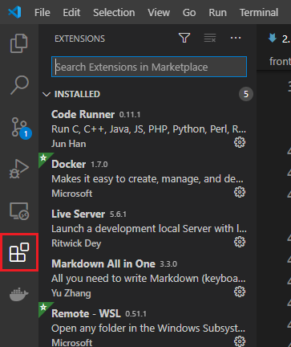
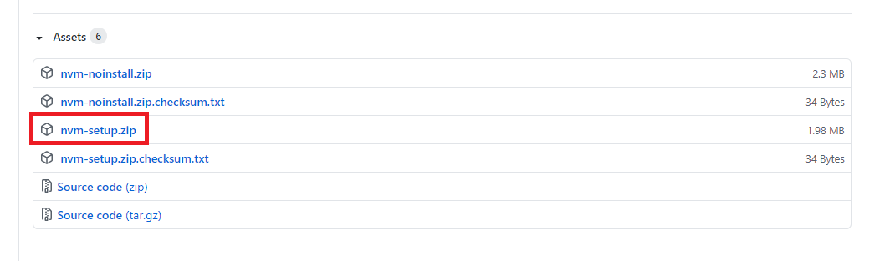

# 목차

- [목차](#목차)
- [1. vscode 설치](#1-vscode-설치)
  - [1.1. 설치해야 할 extensions](#11-설치해야-할-extensions)
- [2. node 설치](#2-node-설치)

# 1. vscode 설치

편집기로 사용하기 위해 vscode를 설치할 필요가 있다.  

[https://code.visualstudio.com/](https://code.visualstudio.com/)

위 링크에서 자신의 컴퓨터에 맞는 vscode를 설치한다.  

## 1.1. 설치해야 할 extensions

우선 검색은 다음 탭에서 한다.  



여기서 다음 세 가지를 설치한다.  

- code runner (필수)
- live server (필수)
- markdown all in one

# 2. node 설치

[https://nodejs.org/en/](https://nodejs.org/en/)

노드는 위 사이트에서 설치할 수 있다. 하지만 nvm을 이용하는 것이 좋기 때문에 nvm으로 안내를 하겠음.  

nvm은 다음 링크에서 받는다.  

[https://github.com/coreybutler/nvm-windows/releases](https://github.com/coreybutler/nvm-windows/releases)

여기서 다음과 같이 nvm-setup을 받아야 한다.  



nvm을 설치하고 나면 다음과 같이 명령어를 입력한다.  


```bash
nvm install 11.0.0
nvm use 11.0.0
```

nvm은 참고로 node version manager의 약자로 노드 버전 관리용 툴이다. 설치가 되고나면 node를 테스트해보자.  

```bash
node -v
```

버전이 잘 출력되면 성공이다.  