# 목차

- [목차](#목차)
- [1. git 설치](#1-git-설치)
- [2. git 세팅](#2-git-세팅)
- [3. Github 설정하기](#3-github-설정하기)
- [4. Github 사용하기](#4-github-사용하기)

# 1. git 설치

깃헙은 git을 이용한 서비스이다. git과 github은 다르다. ~~굳이 따지자면 github이 git의 superset 같은 거라고 봐도 무방하다. 근데 어려운 말은 필요 없으니까 삭제.~~  

설치를 위해 다음 사이트로 이동한다.  

[https://git-scm.com/](https://git-scm.com/)


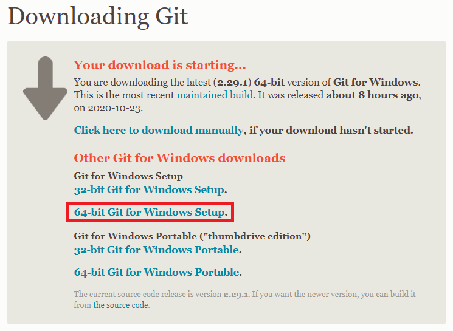

설치를 해보자.  


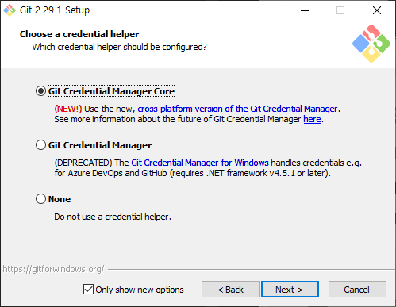

설치가 완료된 경우 `git bash`를 실행해보자.  

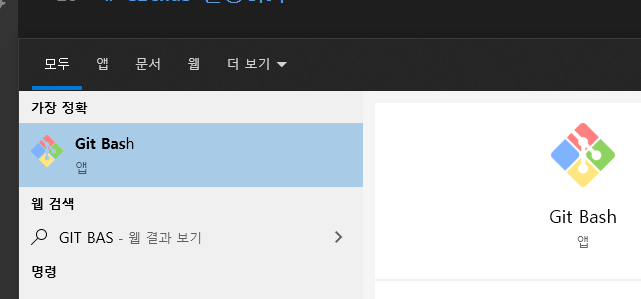

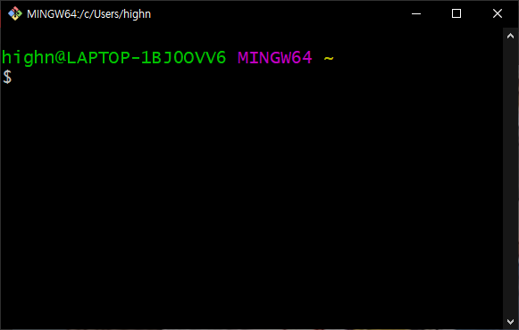

위와 같은 화면이 등장하면 성공한 것이다.  

# 2. git 세팅

`git bash`창에 다음과 같은 명령어를 입력한다.  

```text
ssh-keygen -t rsa -b 4096 -C "your_email@example.com"
```

여기서 `your_email@example.com`에 깃헙 가입 시 사용한 이메일을 적는다.  

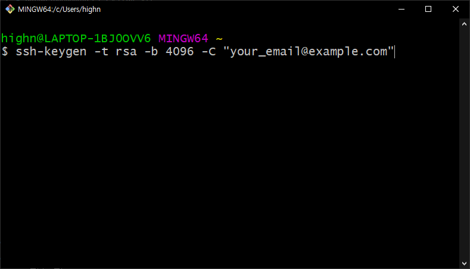

엔터만 계속 입력하자. (비밀번호 굳이 안적어도 됨)  

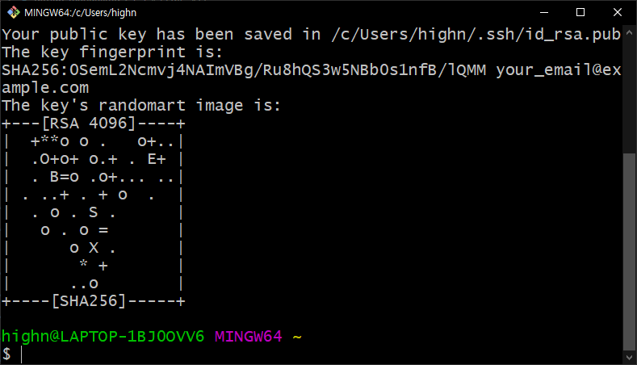

위와 같이 완료가 되면 `공개 키`를 복사해야한다. 다음 명령어로 공개키를 열어보자.  

```text
notepad ~/.ssh/id_rsa.pub
```

메모장에 있는 내용(공개 키)을 복사하고 **반드시 닫는다**. ~~메모장은 닫아주세요 제발..~~  

이제 다음 챕터로 넘어가자.  

# 3. Github 설정하기

깃헙에 가입을 하였다면 이제 공개키를 등록해야한다.  

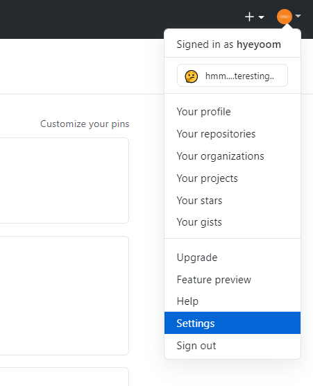

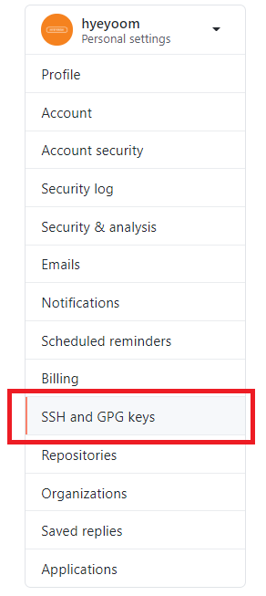

여기서 New SSH 버튼을 누른다.  

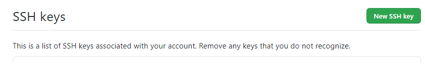

다음과 같은 화면에서 앞서 메모장에서 복사한 `공개 키`를 등록한다.  

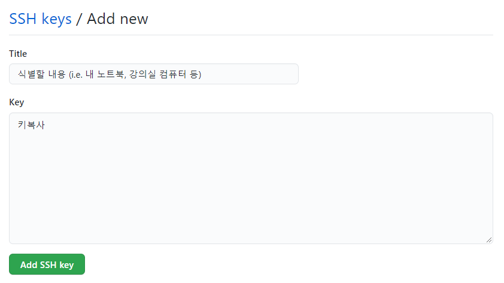

그리고 Add SSH key를 누르면 완료가 된 것임.  

예상되는 에러 상황

- 키 포맷이 안맞는다.
  - ssh-rsa 암호 your_email@example.com
  - 위 형태로 한 줄로 연결되어야 함

# 4. Github 사용하기

우선 Github에 저장소를 만들어보자.  

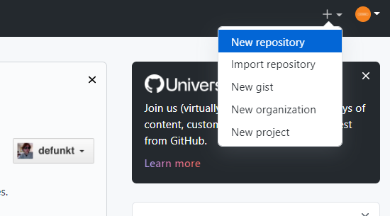
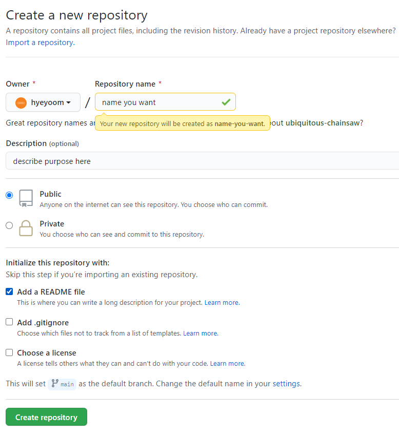

저장소가 생성되고 나면 다음과 같이 저장소로 이동된다.  

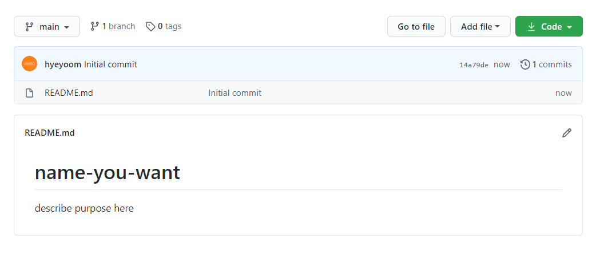

이제 이 저장소를 클론해보자.  

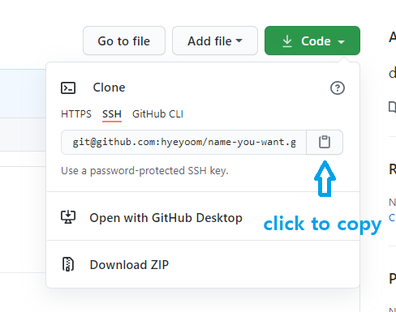

그리고 `git bash`를 열어 다음과 같이 입력하자.  

```text
git clone 복사한주소
```

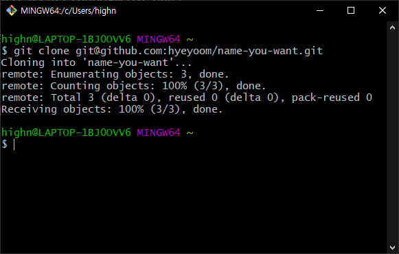

클론 받은 폴더 이름은 저장소 이름이다. 위의 경우에는 `name-you-want` 디렉토리이기 때문에 해당 디렉토리로 이동한다.  

```text
 cd name-you-want/
```

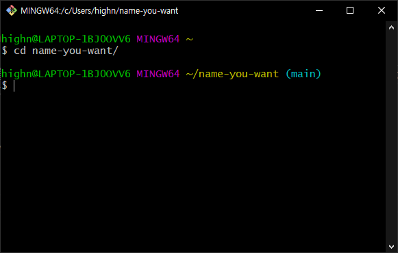

이제 메모장으로 파일을 열어 수정을 해보자.  

```text
notepad README.md
```

그리고 아무 내용이나 적은 후 **저장하고 닫는다**.  

이제 `git status` 명령어를 입력하면 다음과 같은 화면이 등장한다.  

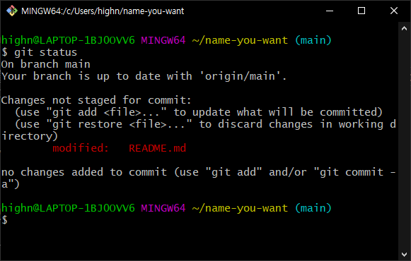

여기서 `git add .`을 입력하고 `git commit -m "HelloWorld"`를 입력하자.  

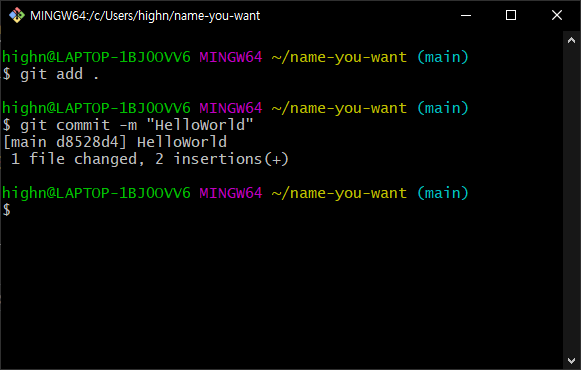

또 다시 `git status`를 입력해보자.  

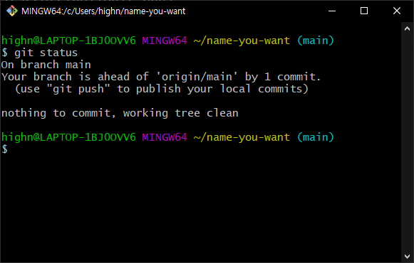

위와 같은 화면이 나왔다면 성공. 이제 `git push`를 입력해서 마무리를 한다.  

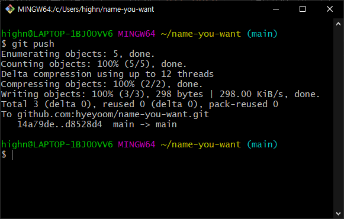

깃허브 저장소로 돌아가서 변경된 내용이 잘 반영되었는지 확인해보자.  

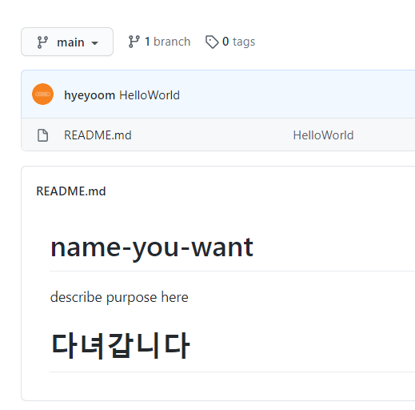