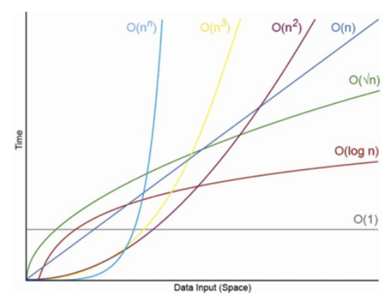
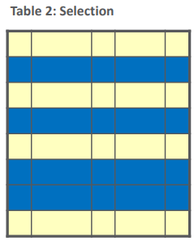
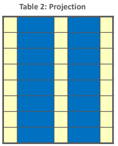

# 목차

- [목차](#목차)
- [Intro.](#intro)
- [0. 실습 환경 구축](#0-실습-환경-구축)
- [1. Cheat Sheet](#1-cheat-sheet)
  - [1.0. 기본 용어](#10-기본-용어)
    - [1.0.1. 테이블](#101-테이블)
    - [1.0.2. 인덱스](#102-인덱스)
  - [1.1. 테이블 제어](#11-테이블-제어)
    - [1.1.1. 테이블 생성](#111-테이블-생성)
    - [1.1.2. 테이블 삭제](#112-테이블-삭제)
  - [1.2. 조회](#12-조회)
    - [1.2.1. SELECTION](#121-selection)
    - [1.2.2. PROJECTION](#122-projection)
    - [1.2.3. 카테시안 곱(Cartesian Product)](#123-카테시안-곱cartesian-product)
    - [1.2.4. JOIN](#124-join)
- [2. Oracle Cheat Sheet](#2-oracle-cheat-sheet)
  - [2.1. 오라클 데이터 타입](#21-오라클-데이터-타입)

# Intro.

이 문서는 SQL을 빠르게 사용하기 위한 cheat sheet 입니다.  

# 0. 실습 환경 구축

sqldeveloper는 동일하므로 생략합니다. 환경 구축을 위해 docker를 설치합니다.  

https://hub.docker.com/editions/community/docker-ce-desktop-windows/

설치는 간단하게 next로 해주면 됩니다.  
설치가 완료되었으면 다음과 같은 명령어를 명령 프롬프트에 복사하고 엔터를 입력해주세요!

```text
docker run --restart=always -d -p 1521:1521 -p 8080:8080 -e ORACLE_ALLOW_REMOTE=true --name oracle hyeyoom/oracle-xe-11g
```

이렇게 하면 데이터베이스 및 데이터가 세팅되어 바로 실습이 가능합니다.  

# 1. Cheat Sheet

## 1.0. 기본 용어

SQL을 이해하기 위해 기본 용어를 정리한다.  

### 1.0.1. 테이블


1. 테이블(릴레이션): 관계형 데이터베이스는 데이터를 표 형태로 저장한다. 이 표에 해당하는 것이 테이블이며, 테이블의 한 행(row)은 여러 칼럼(column)으로 구성되어 있다. 그리고 이 행들이 모인 것을 릴레이션 인스턴스라고 부른다.  
2. 칼럼(속성): 열에 해당하는 데이터
3. 데이터: 말 그대로 값. 이 자체로는 의미가 없지만 모이면 정보가 된다.(테이블의 한 행을 보자)  

### 1.0.2. 인덱스

인덱스는 검색 속도를 향상시키기 위해 존재한다. 검색 속도를 위해 별도의 공간을 할애하여 탐색하기 위한 정보를 형성한다.  

1. pros(장점)
   1. 검색 속도 향상
   2. 시스템 부하 감소
2. cons(단점)
   1. 인덱스를 위한 추가 공간(용량 차지) 필요
   2. 데이터가 변경되면 인덱스 정보가 변경되어 성능 저하 발생 우려
   3. 적은 레코드에서는 의미 없음

TMI 주의(이해 안해도 됨):  

적은 레코드에서 의미가 없는 이유 -> `시간 복잡도(Time Complexity)`



인덱싱을 위해 많이 사용하는 자료구조는 `B Tree`이다. 이 `B Tree`의 시간 복잡도는 `O(log n)`이다. 인덱스가 걸려있지 않다면 모든 데이터를 순회하며 검색하기 때문에 `O(n)`의 복잡도를 가진다. 따라서 데이터의 개수가 많지 않다면 순회하여 검색하는 것이 빠르지만, 어느 시점을 넘어가면 O(log n)이 O(n)보다 시간 소요를 덜 하는 것을 확인할 수 있다.  

## 1.1. 테이블 제어

table 생성/삭제

### 1.1.1. 테이블 생성

```sql
CREATE TABLE 테이블_이름 (
    칼럼_이름1 데이터_타입 제약조건,
    칼럼_이름2 데이터_타입 제약조건,
    ...,
    칼럼_이름N 데이터_타입 제약조건,
);
```

사용할 수 있는 데이터 타입은 아래 [링크](#21-오라클-데이터-타입)를 참고하자.

예제

```sql
CREATE TABLE CUSTOMER (
    id NUMBER NOT NULL,
    name VARCHAR2(128) NOT NULL,
    email VARCHAR2(128) NOT NULL
);
```

위 테이블은 자바의 경우 다음 클래스와 매핑될 수 있음

```java
@Entity
public class Customer {
    @Id
    @GeneratedValue
    private Long id;

    @Column(nullable = false)
    private String name;

    @Column(nullable = false)
    private String email;
}
```

달려있는 `어노테이션`은 무시하고 읽어도 상관 없음.

### 1.1.2. 테이블 삭제  

경고: 모든 데이터가 삭제됩니다.  

```sql
DROP TABLE 테이블_이름;
```

## 1.2. 조회

조회는 기본적으로 SELECT 절을 사용한다.  

```sql
SELECT 열1, 열2, ..., 열N FROM 테이블_이름;
```

### 1.2.1. SELECTION

모든 열(column)을 선택하는 것이 셀렉션

```sql
SELECT * FROM 테이블_이름;
```



### 1.2.2. PROJECTION

일부 열(column)을 선택하는 것이 프로젝션

```sql
SELECT 열1, 열2, ..., 열N FROM 테이블_이름;
```



### 1.2.3. 카테시안 곱(Cartesian Product)

크로스 조인(Cross Join)이라고도 부름


조합 가능한 모든 경우의 수를 보여줄 수 있다는 장점 외에는 없으니까 쓰지 말도록 하자. (의도하지 않은 데이터가 나오므로)  

### 1.2.4. JOIN

JOIN을 하기 위한 두 가지 방법.  

(1) `FROM` 절에서 조인

```sql
FROM 테이블1 테이블1_별칭, 테이블2 테이블2_별칭, ..., 테이블N 테이블N_별칭
WHERE 조인_조건1 AND 조인_조건2 AND ... AND 조인_조건N
```

예제

```sql
SELECT * FROM emp e, dept d WHERE e.deptno = d.deptno;
```

(2) `JOIN`과 `ON` 사용

```sql
FROM 테이블1 테이블1_별칭
JOIN 테이블2 테이블2_별칭 ON 조인_조건
...
JOIN 테이블N 테이블N_별칭 ON 조인_조건
```

예제

```sql
SELECT *
FROM emp e 
JOIN dept d ON e.deptno = d.deptno;
```

# 2. Oracle Cheat Sheet

오라클 한정적인 치트 시트. 다른 벤더(i.e. mysql, posgres)의 DB에서는 안통할 수도 있으니 찾아서 사용할 것!

## 2.1. 오라클 데이터 타입

다른 벤더의 데이터 타입과 겹치는 것도 있고 아닌 것도 있으니까 유의하면서 사용합시다.  

|데이터 타입|설명|
|-|-|
|NUMBER|40자리 숫자 까지 저장 가능. 자바로 따지면 `long`|
|NUMBER(S)|범위 0 <= S <= 38. 자바로 따지면 `long`|
|LOB(Large OBject)|최대 2GB 바이너리 데이터. **가급적 쓰지 말 것**|
|DATE|날짜 및 시간 데이터. 자바로 따지면 `LocalDateTime`|
|TIMESTAMP(i)|i는 정밀도. 9까지 됨. DATE보단 이 친구를 사용하자.|
|CHAR(size)|고정 길이의 문자열 데이터|
|VARCHAR2(size)|가변 길이의 문자열 데이터|

- VARCHAR랑 VARCHAR2의 차이점은?
  - 동작은 동일
  - VARCHAR는 null과 빈 문자열 구분
  - VARCHAR2는 null과 빈 문자열 구분 안함

