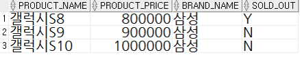
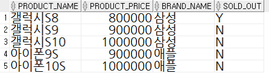
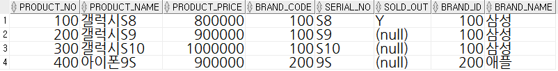
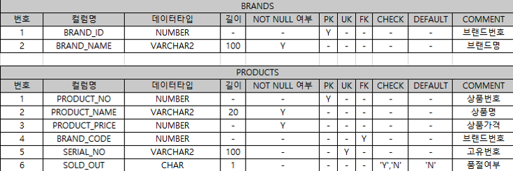
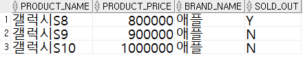

# 목차

- [목차](#목차)
- [1. 문제](#1-문제)
  - [1.1. 질문](#11-질문)
  - [1.2. 요구사항](#12-요구사항)
  - [1.3. 정상 결과(expected)](#13-정상-결과expected)
  - [1.4. 수행 결과(actual)](#14-수행-결과actual)
  - [1.5. 작성한 SQL](#15-작성한-sql)
    - [BRANDS 테이블 생성](#brands-테이블-생성)
    - [PRODUCTS 테이블 생성](#products-테이블-생성)
    - [SEQ_BRAND_ID 시퀀스 생성](#seq_brand_id-시퀀스-생성)
    - [SEQ_PRODUCT_NO 시퀀스 생성](#seq_product_no-시퀀스-생성)
    - [BRANDS 테이블 데이터 삽입](#brands-테이블-데이터-삽입)
    - [PRODUCTS 테이블 데이터 삽입](#products-테이블-데이터-삽입)
    - [결과 조회](#결과-조회)
- [2. 문제](#2-문제)
  - [2.1. 질문](#21-질문)
  - [2.2. 요구사항](#22-요구사항)
  - [2.3. 정상 결과(expected)](#23-정상-결과expected)
  - [2.4. 수행 결과(actual)](#24-수행-결과actual)
  - [2.5. 작성한 SQL](#25-작성한-sql)
    - [BRANDS 테이블 생성](#brands-테이블-생성-1)
    - [PRODUCTS 테이블 생성](#products-테이블-생성-1)
    - [SEQ_BRAND_ID 시퀀스 생성](#seq_brand_id-시퀀스-생성-1)
    - [SEQ_PRODUCT_NO 시퀀스 생성](#seq_product_no-시퀀스-생성-1)
    - [BRANDS 테이블 데이터 삽입](#brands-테이블-데이터-삽입-1)
    - [PRODUCTS 테이블 데이터 삽입](#products-테이블-데이터-삽입-1)
    - [결과 조회](#결과-조회-1)
- [3. 문제](#3-문제)
  - [3.1. 질문](#31-질문)
  - [3.2. 요구사항](#32-요구사항)
  - [3.3. 정상 결과(expected)](#33-정상-결과expected)
  - [3.4. 수행 결과(actual)](#34-수행-결과actual)
  - [3.5. 작성한 SQL](#35-작성한-sql)
    - [BRANDS 테이블 생성](#brands-테이블-생성-2)
    - [PRODUCTS 테이블 생성](#products-테이블-생성-2)
    - [SEQ_BRAND_ID 시퀀스 생성](#seq_brand_id-시퀀스-생성-2)
    - [SEQ_PRODUCT_NO 시퀀스 생성](#seq_product_no-시퀀스-생성-2)
    - [BRANDS 테이블 데이터 삽입](#brands-테이블-데이터-삽입-2)
    - [PRODUCTS 테이블 데이터 삽입](#products-테이블-데이터-삽입-2)

# 1. 문제

능력 단위 요소

- 2001020413_16v3.1 기본 SQL 작성하기
- 2001020413_16v3.2 고급 SQL 작성하기

## 1.1. 질문

테이블 정의서에 따라 테이블을 생성하고, 요구사항을 충족할 수 있도록 시퀀스를 생성하는 SQL작성 후 정상 결과와 같은 같은 형태로 데이터를 조회하기 위하여, 데이터 삽입, 조회를 수행하였으나 정상처리되지 않는 문제가 발생하였다. SQL구문을 분석하여 요구사항을 충족시키지 못하거나, 정상 결과가 조회되지 않은 원인과, 정상 결과가 조회될 수 있도록 하는 조치내용을 순서대로 작성하시오.
(단, 답안 작성 시 이미 생성된 테이블 또는 시퀀스 구조의 수정이 필요한 경우 ALTER 또는 DROP, 삽입된 데이터의 수정이 필요한 경우 UPDATE 사용.)

## 1.2. 요구사항

테이블 정의서


시퀀스

- SEQ_BRAND_ID : 100부터 시작하여 100씩 증가, 최대값 1000, 반복 없음.
- SEQ_PRODUCT_NO : 1부터 시작하여 1씩 증가, 최대값 10000, 반복 없음.

## 1.3. 정상 결과(expected)


## 1.4. 수행 결과(actual)



## 1.5. 작성한 SQL

### BRANDS 테이블 생성

```sql
CREATE TABLE BRANDS(
    BRAND_ID NUMBER PRIMARY KEY,
    BRAND_NAME VARCHAR2(100) NOT NULL
);
```

### PRODUCTS 테이블 생성

```sql
CREATE TABLE PRODUCTS(
    PRODUCT_NO NUMBER PRIMARY KEY,
    PRODUCT_NAME VARCHAR2(50) NOT NULL,
    PRODUCT_PRICE NUMBER NOT NULL,
    BRAND_CODE NUMBER REFERENCES BRANDS,
    SERIAL_NO VARCHAR2(100),
    SOLD_OUT CHAR(1) DEFAULT 'N' CHECK(SOLD_OUT IN ('Y', 'N'))
);
```

### SEQ_BRAND_ID 시퀀스 생성

```sql
CREATE SEQUENCE SEQ_BRAND_ID
START WITH 100
INCREMENT BY 100
MAXVALUE 500
NOCYCLE;
```

### SEQ_PRODUCT_NO 시퀀스 생성

```sql
CREATE SEQUENCE SEQ_PRODUCT_NO
START WITH 1
INCREMENT BY 1
MAXVALUE 10000
NOCYCLE;
```

### BRANDS 테이블 데이터 삽입

```sql
INSERT INTO BRANDS VALUES (SEQ_BRAND_ID.NEXTVAL, '삼성');
INSERT INTO BRANDS VALUES (SEQ_BRAND_ID.CURRVAL, '애플');
```

### PRODUCTS 테이블 데이터 삽입

```sql
INSERT INTO PRODUCTS VALUES (SEQ_PRODUCT_NO.NEXTVAL, '갤럭시S8', 800000, 100, 'S8','Y');
INSERT INTO PRODUCTS VALUES (SEQ_PRODUCT_NO.NEXTVAL, '갤럭시S9', 900000, 100, 'S9','N');
INSERT INTO PRODUCTS VALUES (SEQ_PRODUCT_NO.NEXTVAL, '갤럭시S10', 1000000, 100, 'S10','N');
INSERT INTO PRODUCTS VALUES (SEQ_PRODUCT_NO.NEXTVAL, '아이폰9S', 900000, 200, '9S','N');
INSERT INTO PRODUCTS VALUES (SEQ_PRODUCT_NO.NEXTVAL, '아이폰10S', 1000000, 200, '10S','N');
```

### 결과 조회

```sql
SELECT PRODUCT_NAME, PRODUCT_PRICE, BRAND_NAME, SOLD_OUT
FROM PRODUCTS JOIN BRANDS ON (BRAND_ID = BRAND_CODE);
```

# 2. 문제

능력 단위 요소

- 2001020413_16v3.1 기본 SQL 작성하기
- 2001020413_16v3.2 고급 SQL 작성하기

## 2.1. 질문

테이블 정의서에 따라 테이블을 생성하고, 요구사항을 충족할 수 있도록 시퀀스를 생성하는 SQL작성 후 정상 결과와 같은 같은 형태로 데이터를 조회하기 위하여, 데이터 삽입, 조회를 수행하였으나 정상처리되지 않는 문제가 발생하였다. SQL구문을 분석하여 요구사항을 충족시키지 못하거나, 정상 결과가 조회되지 않은 원인과, 정상 결과가 조회될 수 있도록 하는 조치내용을 순서대로 작성하시오.
(단, 답안 작성 시 이미 생성된 테이블 또는 시퀀스 구조의 수정이 필요한 경우 ALTER 또는 DROP, 삽입된 데이터의 수정이 필요한 경우 UPDATE 사용.)

## 2.2. 요구사항

테이블 정의서


시퀀스

- SEQ_BRAND_ID : 100부터 시작하여 100씩 증가, 최대값 1000, 반복 없음.
- SEQ_PRODUCT_NO : 1부터 시작하여 1씩 증가, 최대값 10000, 반복 없음.

## 2.3. 정상 결과(expected)



## 2.4. 수행 결과(actual)



## 2.5. 작성한 SQL

### BRANDS 테이블 생성

```sql
CREATE TABLE BRANDS(
    BRAND_ID NUMBER PRIMARY KEY,
    BRAND_NAME VARCHAR2(100) NOT NULL
);
```

### PRODUCTS 테이블 생성

```sql
CREATE TABLE PRODUCTS(
    PRODUCT_NO NUMBER PRIMARY KEY,
    PRODUCT_NAME VARCHAR2(50) NOT NULL,
    PRODUCT_PRICE NUMBER NOT NULL,
    BRAND_CODE NUMBER REFERENCES BRANDS,
    SERIAL_NO VARCHAR2(100) UNIQUE,
    SOLD_OUT CHAR(1) CHECK(SOLD_OUT IN ('Y', 'N'))
);
```

### SEQ_BRAND_ID 시퀀스 생성

```sql
CREATE SEQUENCE SEQ_BRAND_ID
START WITH 100
INCREMENT BY 100
MAXVALUE 1000
NOCYCLE;
```

### SEQ_PRODUCT_NO 시퀀스 생성

```sql
CREATE SEQUENCE SEQ_PRODUCT_NO
START WITH 100
INCREMENT BY 100
MAXVALUE 10000
NOCYCLE;
```

### BRANDS 테이블 데이터 삽입

```sql
INSERT INTO BRANDS VALUES (SEQ_BRAND_ID.NEXTVAL, '삼성');
INSERT INTO BRANDS VALUES (SEQ_BRAND_ID.NEXTVAL, '애플');
```

### PRODUCTS 테이블 데이터 삽입

```sql
INSERT INTO PRODUCTS VALUES (SEQ_PRODUCT_NO.NEXTVAL, '갤럭시S8', 800000, 100, 'S8', 'Y');
INSERT INTO PRODUCTS VALUES (SEQ_PRODUCT_NO.NEXTVAL, '갤럭시S9', 900000, 100, 'S9',DEFAULT);
INSERT INTO PRODUCTS VALUES (SEQ_PRODUCT_NO.NEXTVAL, '갤럭시S10', 1000000, 100, 'S10',DEFAULT);
INSERT INTO PRODUCTS VALUES (SEQ_PRODUCT_NO.NEXTVAL, '아이폰9S', 900000, 200, '9S',DEFAULT);
INSERT INTO PRODUCTS VALUES (SEQ_PRODUCT_NO.NEXTVAL, '아이폰10S', 1000000, 200, 'S10',DEFAULT);
```

### 결과 조회

```sql
SELECT * FROM PRODUCTS JOIN BRANDS ON (BRAND_ID = BRAND_CODE);
```

# 3. 문제

능력 단위 요소

- 2001020413_16v3.1 기본 SQL 작성하기
- 2001020413_16v3.2 고급 SQL 작성하기

## 3.1. 질문

테이블 정의서에 따라 테이블을 생성하고, 요구사항을 충족할 수 있도록 시퀀스를 생성하는 SQL작성 후 정상 결과와 같은 같은 형태로 데이터를 조회하기 위하여, 데이터 삽입, 조회를 수행하였으나 정상처리되지 않는 문제가 발생하였다. SQL구문을 분석하여 요구사항을 충족시키지 못하거나, 정상 결과가 조회되지 않은 원인과, 정상 결과가 조회될 수 있도록 하는 조치내용을 순서대로 작성하시오.
(단, 답안 작성 시 이미 생성된 테이블 또는 시퀀스 구조의 수정이 필요한 경우 ALTER 또는 DROP, 삽입된 데이터의 수정이 필요한 경우 UPDATE 사용.)

## 3.2. 요구사항

테이블 정의서



시퀀스

- SEQ_BRAND_ID : 100부터 시작하여 100씩 증가, 최대값 1000, 반복 없음.
- SEQ_PRODUCT_NO : 1부터 시작하여 1씩 증가, 최대값 10000, 반복 없음.

## 3.3. 정상 결과(expected)


## 3.4. 수행 결과(actual)



## 3.5. 작성한 SQL

### BRANDS 테이블 생성

```sql
CREATE TABLE BRANDS(
    BRAND_ID NUMBER PRIMARY KEY,
    BRAND_NAME VARCHAR2(100) NOT NULL
);
```

### PRODUCTS 테이블 생성

```sql
CREATE TABLE PRODUCTS(
    PRODUCT_NO NUMBER PRIMARY KEY,
    PRODUCT_NAME VARCHAR2(50),
    PRODUCT_PRICE NUMBER NOT NULL,
    BRAND_CODE NUMBER REFERENCES BRANDS,
    SERIAL_NO VARCHAR2(100) UNIQUE,
    SOLD_OUT CHAR(1) DEFAULT 'N' CHECK(SOLD_OUT IN ('Y', 'N'))
);
```

### SEQ_BRAND_ID 시퀀스 생성

```sql
CREATE SEQUENCE SEQ_BRAND_ID
START WITH 100
INCREMENT BY 100
MAXVALUE 1000
NOCYCLE;
```

### SEQ_PRODUCT_NO 시퀀스 생성

```sql
CREATE SEQUENCE SEQ_PRODUCT_NO
START WITH 1
INCREMENT BY 1
MAXVALUE 10000
NOCYCLE;
```

### BRANDS 테이블 데이터 삽입

```sql
INSERT INTO BRANDS VALUES (SEQ_BRAND_ID.CURRVAL, '삼성');
INSERT INTO BRANDS VALUES (SEQ_BRAND_ID.NEXTVAL, '애플');
```

### PRODUCTS 테이블 데이터 삽입

```sql
INSERT INTO PRODUCTS VALUES (SEQ_PRODUCT_NO.NEXTVAL, '갤럭시S8', 800000, 100, 'S8', 'Y');
INSERT INTO PRODUCTS VALUES (SEQ_PRODUCT_NO.NEXTVAL, '갤럭시S9', 900000, 100, 'S9',DEFAULT);
INSERT INTO PRODUCTS VALUES (SEQ_PRODUCT_NO.NEXTVAL, '갤럭시S10', 1000000, 100, 'S10',DEFAULT);
INSERT INTO PRODUCTS VALUES (SEQ_PRODUCT_NO.NEXTVAL, '아이폰9S', 900000, 200, '9S',DEFAULT);
INSERT INTO PRODUCTS VALUES (SEQ_PRODUCT_NO.NEXTVAL, '아이폰10S', 1000000, 300, '10S',DEFAULT);
```