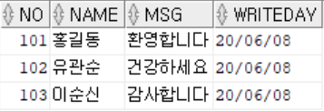

# 목차

- [목차](#목차)
- [0. DB 스키마](#0-db-스키마)
- [1. 문제](#1-문제)
	- [1.1. 질문](#11-질문)
	- [1.2. 요구사항](#12-요구사항)
	- [1.3. 코드](#13-코드)
		- [1.3.1. Memo.java](#131-memojava)
		- [1.3.2. Controller.java](#132-controllerjava)
		- [1.3.3. Dao.java](#133-daojava)
	- [1.4. 문제 풀이](#14-문제-풀이)
		- [1.4.1. 원인 파악](#141-원인-파악)
		- [1.4.2. 조치](#142-조치)
- [2. 문제](#2-문제)
	- [2.1. 질문](#21-질문)
	- [2.2. 요구사항](#22-요구사항)
	- [2.3. 코드](#23-코드)
		- [2.3.1. Memo.java](#231-memojava)
		- [2.3.2. Controller.java](#232-controllerjava)
		- [2.3.3. Dao.java](#233-daojava)
	- [2.4. 문제 풀이](#24-문제-풀이)
		- [2.4.1. 원인 파악](#241-원인-파악)
		- [2.4.2. 조치](#242-조치)
- [3. 문제](#3-문제)
	- [3.1. 질문](#31-질문)
	- [3.2. 요구사항](#32-요구사항)
	- [3.3. 코드](#33-코드)
		- [3.3.1. Memo.java](#331-memojava)
		- [3.3.2. Controller.java](#332-controllerjava)
		- [3.3.3. Dao.java](#333-daojava)
	- [3.4. 문제 풀이](#34-문제-풀이)
		- [3.4.1. 원인 파악](#341-원인-파악)
		- [3.4.2. 조치](#342-조치)

# 0. DB 스키마

```sql
CREATE TABLE memo (
    no NUMBER PRIMARY KEY,
    name VARCHAR2(128) NOT NULL,
    msg VARCHAR2(128) NOT NULL,
    writeday DATE DEFAULT sysdate
);
INSERT INTO memo VALUES (101, '한석규', '한석귭니다', DEFAULT);
INSERT INTO memo VALUES (102, '유관순', '건강하세요', DEFAULT);
INSERT INTO memo VALUES (103, '이순신', '감사합니다', DEFAULT);
COMMIT;
SELECT * FROM memo;
```

# 1. 문제

능력 단위 요소

- 2001020414_19v4.2 응용 SQL 작성하기

## 1.1. 질문

프로그램 실행결과의 기대값은 아래와 같이 MEMO 테이블의 정보가 출력되어져야 한다.
하지만 출력되지 않고 여러가지 오류만 발생하였다.
오류가 발생한 원인을 기술하고 기대값대로 MEMO 테이블의 정보가 출력되도록 소스를 수정하시오.(단, 실행클래스에서 정상적으로 Controller클래스의 main()호출함)

## 1.2. 요구사항

MEMO 테이블


예상 출력 결과


## 1.3. 코드

### 1.3.1. Memo.java

```java
import java.sql.Date;
public class Memo {

	private int no;
	private String name;
	private String msg;
	private Date writeday;

	public Memo() {
		super();
	}

	public Memo(int no, String name, String msg, Date writeday) {
		super();
		this.no = no;
		this.name = name;
		this.msg = msg;
		this.writeday = writeday;
	}

	public int getNo() {
		return no;
	}

	public void setNo(int no) {
		this.no = no;
	}

	public String getName() {
		return name;
	}

	public void setName(String name) {
		this.name = name;
	}

	public String getMsg() {
		return msg;
	}

	public void setMsg(String msg) {
		this.msg = msg;
	}

	public Date getWriteday() {
		return writeday;
	}

	public void setWriteday(Date writeday) {
		this.writeday = writeday;
	}	
}
```

### 1.3.2. Controller.java

```java
import java.util.ArrayList;
import kh.exam.dao.Dao;
import kh.exam.vo.Memo;

public class Controller {
	public void main() {
		Dao dao = new Dao();
		ArrayList<Memo> list = dao.selectAll();
		if(list.isEmpty()) {
			System.out.println("데이터가 없습니다.");
		}else {
			System.out.println("NO\tNAME\tMSG\tWRITEDAY");
			System.out.println("-----------------------------------");
			for(Memo m : list) {
				System.out.println(m.getNo() + "\t" + m.getName() + "\t" + m.getMsg() + "\t" + m.getWriteday());			
			}
		}
		
	}
}
```

### 1.3.3. Dao.java

```java
import java.sql.Connection;
import java.sql.DriverManager;
import java.sql.PreparedStatement;
import java.sql.ResultSet;
import java.sql.SQLException;
import java.util.ArrayList;
import kh.exam.vo.Memo;

public class Dao {

	public ArrayList<Memo> selectAll() {
		ArrayList<Memo> list = new ArrayList<Memo>();
		Connection conn = null;
		PreparedStatement pstmt = null;
		ResultSet rset = null;
		String query = "select * from memo";
		try {
			Class.forName("oracle.jdbc.driver.OracleDriver");
			conn = DriverManager.getConnection("jdbc:oracle:thin:@127.0.0.1:1521:xe", "oracleuser", "pwd1234");
			pstmt = conn.prepareStatement(query);
			rset = pstmt.executeQuery();
			if(rset.next()) {
				Memo m = new Memo();
				m.setNo(rset.getInt(0));
				m.setName(rset.getString(1));
				m.setMsg(rset.getString(2));
				m.setWriteday(rset.getDate(3));				
			}
		} catch (ClassNotFoundException e) {			
			e.printStackTrace();
		} catch (SQLException e) {
			e.printStackTrace();
		}finally {
			try {
				rset.close();
				pstmt.close();
				conn.close();
			} catch (SQLException e) {
				e.printStackTrace();
			}
		}
		return list;
	}
}
```

## 1.4. 문제 풀이

### 1.4.1. 원인 파악

1. ResultSet에서 조회한 결과를 불러 올 때, 컬럼 순서는 1부터 시작이지만 0부터 시작하게 작성함
2. 조회된 결과를 Memo 객체에 저장 한 뒤 리턴하는 list에 추가하지 않고 빈 리스트를 리턴함
3. 조회 결과 처리하는 코드에서 if를 사용했기 때문에 여러 row가 조회되어도 상단의 첫 행만 처리하고 끝

```text
BOF
101	한석규	한석귭니다	20/11/05  << cursor
102	유관순	건강하세요	20/11/05
103	이순신	감사합니다	20/11/05
EOF
```

### 1.4.2. 조치

```java
// 3번 원인 조치 - if를 while로 변경하여 여러 row를 처리할 수 있도록 함
while (rset.next()) {
    Memo m = new Memo();
    // 1번 원인 조치 - 컬럼 인덱스 수정
    m.setNo(rset.getInt(1));
    m.setName(rset.getString(2));
    m.setMsg(rset.getString(3));
    m.setWriteday(rset.getDate(4));
    // 2번 원인 조치 - list에 메모 추가
    list.add(m);
}
```

# 2. 문제

능력 단위 요소

- 2001020414_19v4.2 응용 SQL 작성하기

## 2.1. 질문

프로그램 실행결과의 기대값은 아래와 같이 MEMO 테이블의 정보가 출력되어져야 한다.
하지만 출력되지 않고 여러가지 오류만 발생하였다.
오류가 발생한 원인을 기술하고 기대값대로 MEMO 테이블의 정보가 출력되도록 소스를 수정하시오.(단, 실행클래스에서 정상적으로 Controller클래스의 main()호출함)

## 2.2. 요구사항

MEMO 테이블


예상 출력 결과


## 2.3. 코드

### 2.3.1. Memo.java

```java
import java.sql.Date;
public class Memo {
	private int no;
	private String name;
	private String msg;
	private Date writeday;
	public Memo() {
		super();
	}
	public Memo(int no, String name, String msg, Date writeday) {
		super();
		this.no = no;
		this.name = name;
		this.msg = msg;
		this.writeday = writeday;
	}
	public int getNo() {
		return no;
	}
	public void setNo(int no) {
		this.no = no;
	}
	public String getName() {
		return name;
	}
	public void setName(String name) {
		this.name = name;
	}
	public String getMsg() {
		return msg;
	}
	public void setMsg(String msg) {
		this.msg = msg;
	}
	public Date getWriteday() {
		return writeday;
	}
	public void setWriteday(Date writeday) {
		this.writeday = writeday;
	}	
}
```

### 2.3.2. Controller.java

```java
import java.util.ArrayList;
import kh.exam.dao.Dao;
import kh.exam.vo.Memo;
public class Controller {
	public void main() {
		Dao dao = new Dao();
		Memo m = dao.selectOne(101);
		if(m == null) {
			System.out.println("데이터가 없습니다.");
		}else {
			System.out.println("NO\tNAME\tMSG\tWRITEDAY");
			System.out.println("-----------------------------------");
			System.out.println(m.getNo() + "\t" + m.getName() + "\t" + m.getMsg() + "\t" + m.getWriteday());			
			
		}
	}
}
```

### 2.3.3. Dao.java

```java
import java.sql.Connection;
import java.sql.DriverManager;
import java.sql.PreparedStatement;
import java.sql.ResultSet;
import java.sql.SQLException;
import java.util.ArrayList;
import kh.exam.vo.Memo;
public class Dao {
	public Memo selectOne(int no) {
		Memo m = null;
		Connection conn = null;
		PreparedStatement pstmt = null;
		ResultSet rset = null;
		String query = "select * from memo where no = ?";
		try {
			Class.forName("oracle.jdbc.driver.OracleDriver");
			conn = DriverManager.getConnection("jdbc:oracle:thin:@127.0.0.1:1521:xe", "oracleuser", "pwd1234");
			pstmt = conn.prepareStatement(query);
			pstmt.setInt(0, no);
			rset = pstmt.executeQuery();
			if(rset.next()) {
				m = new Memo();
				m.setNo(rset.getInt(0));
				m.setName(rset.getString(1));
				m.setMsg(rset.getString(2));
				m.setWriteday(rset.getDate(3));				
			}
		} catch (ClassNotFoundException e) {
			e.printStackTrace();
		} catch (SQLException e) {
			e.printStackTrace();
		}
		return m;
	}
}
```

## 2.4. 문제 풀이

### 2.4.1. 원인 파악

1. ResultSet에서 조회한 결과를 불러 올 때, 컬럼 순서는 1부터 시작이지만 0부터 시작하게 작성함
2. 위치홀더(`?`기호)에 값 대입 시 시작은 1부터지만 0부터 시작했기 때문에 문제 발생
3. 자원을 반환하는 코드 존재하지 않음

### 2.4.2. 조치

1. 인덱스 1부터 시작하도록 변경

```java
m.setNo(rset.getInt(1));
m.setName(rset.getString(2));
m.setMsg(rset.getString(3));
m.setWriteday(rset.getDate(4));		
```

2. 위치홀더 1부터 시작하도록 변경

```java
pstmt.setInt(1, no);
```

3. 자원을 반환하는 코드 추가 - finally 블록

```java
finally {
	try {
		rset.close();
		pstmt.close();
		conn.close();
	} catch (SQLException se) {
		se.printStackTrace();
	}
}
```

# 3. 문제

능력 단위 요소

- 2001020414_19v4.2 응용 SQL 작성하기

## 3.1. 질문

프로그램 실행결과의 기대값은 아래와 같이 MEMO 테이블의 정보가 출력되어져야 한다.
하지만 출력되지 않고 여러가지 오류만 발생하였다.
오류가 발생한 원인을 기술하고 기대값대로 MEMO 테이블의 정보가 출력되도록 소스를 수정하시오.(단, 실행클래스에서 정상적으로 Controller클래스의 main()호출함)

## 3.2. 요구사항

MEMO 테이블


예상 출력 결과



## 3.3. 코드

### 3.3.1. Memo.java

```java
public class Memo {
    private int no;
    private String name;
    private String msg;
    private Date writeday;

    public Memo() {
        super();
    }

    public Memo(int no, String name, String msg, Date writeday) {
        super();
        this.no = no;
        this.name = name;
        this.msg = msg;
        this.writeday = writeday;
    }

    public int getNo() {
        return no;
    }

    public void setNo(int no) {
        this.no = no;
    }

    public String getName() {
        return name;
    }

    public void setName(String name) {
        this.name = name;
    }

    public String getMsg() {
        return msg;
    }

    public void setMsg(String msg) {
        this.msg = msg;
    }

    public Date getWriteday() {
        return writeday;
    }

    public void setWriteday(Date writeday) {
        this.writeday = writeday;
    }
}
```

### 3.3.2. Controller.java

```java
import kh.exam.dao.Dao;
import kh.exam.vo.Memo;

public class Controller {
    public void main() {
        Dao dao = new Dao();
        Memo m = new Memo();
        m.setNo(101);
        m.setName("홍길동");
        m.setMsg("환영합니다");
        int result = dao.update(m);
        if (result < 1) {
            System.out.println("변경 성공");
        } else {
            System.out.println("변경 실패");
        }
    }
}
```

### 3.3.3. Dao.java

```java
import java.sql.Connection;
import java.sql.DriverManager;
import java.sql.PreparedStatement;
import java.sql.ResultSet;
import java.sql.SQLException;
import java.util.ArrayList;
import kh.exam.vo.Memo;
public class Dao {
	public int update(Memo m) {
		Connection conn = null;
		PreparedStatement pstmt = null;		
		int result = 0;
		String query = "update memo set name = ?, msg = ? where no = ?";
		try {
			Class.forName("oracle.jdbc.driver.OracleDriver");
			conn = DriverManager.getConnection("jdbc:oracle:thin:@127.0.0.1:1521:xe", "oracleuser", "pwd1234");
			pstmt = conn.prepareStatement(query);
			pstmt.setString(1, m.getName());
			pstmt.setString(2, m.getMsg());
			pstmt.setInt(3, m.getNo());
			result = pstmt.executeQuery();			
		} catch (ClassNotFoundException e) {			
			e.printStackTrace();
		} catch (SQLException e) {
			e.printStackTrace();
		}finally {
			try {				
				pstmt.close();
				conn.close();
			} catch (SQLException e) {
				e.printStackTrace();
			}
		}
		return result;
	}
}
```

## 3.4. 문제 풀이

### 3.4.1. 원인 파악

1. DML은 executeQuery가 아닌 executeUpdate를 실행해야함
2. 올바르게 실행되었으나, 최종 결과 출력 시 if문의 조건(result < 1)이 잘못됐다.
3. update 수행 후 commit, rollback 코드가 존재하지 않음

### 3.4.2. 조치

1. executeQuery -> executeUpdate

```java
result = pstmt.executeUpdate();
```

2. 조건 변경

```java
if (result > 1) {
	System.out.println("변경 성공");
} else {
	System.out.println("변경 실패");
}
```

3. Dao에서 쿼리 수행 후 commit, rollback 코드 추가

```java
if(result > 0) {
	conn.commit();
}else {
	conn.rollback();
}
```