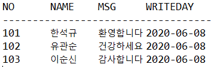
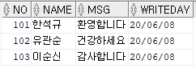
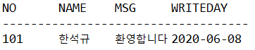

# 목차

- [목차](#목차)
- [1. 문제](#1-문제)
  - [1.1. 질문](#11-질문)
  - [1.2. 요구사항](#12-요구사항)
  - [1.3. 코드](#13-코드)
    - [1.3.1. Memo.java](#131-memojava)
    - [1.3.2. Controller.java](#132-controllerjava)
    - [1.3.3. Dao.java](#133-daojava)
- [2. 문제](#2-문제)
  - [2.1. 질문](#21-질문)
  - [2.2. 요구사항](#22-요구사항)
  - [2.3. 코드](#23-코드)
    - [2.3.1. Memo.java](#231-memojava)
    - [2.3.2. Controller.java](#232-controllerjava)
    - [2.3.3. Dao.java](#233-daojava)

# 1. 문제

능력 단위 요소

- 2001020414_19v4.2 응용 SQL 작성하기

## 1.1. 질문

프로그램 실행결과의 기대값은 아래와 같이 MEMO 테이블의 정보가 출력되어져야 한다.
하지만 출력되지 않고 여러가지 오류만 발생하였다.
오류가 발생한 원인을 기술하고 기대값대로 MEMO 테이블의 정보가 출력되도록 소스를 수정하시오.(단, 실행클래스에서 정상적으로 Controller클래스의 main()호출함)

## 1.2. 요구사항

MEMO 테이블


예상 출력 결과



## 1.3. 코드

### 1.3.1. Memo.java

```java
import java.sql.Date;
public class Memo {

	private int no;
	private String name;
	private String msg;
	private Date writeday;

	public Memo() {
		super();
	}

	public Memo(int no, String name, String msg, Date writeday) {
		super();
		this.no = no;
		this.name = name;
		this.msg = msg;
		this.writeday = writeday;
	}

	public int getNo() {
		return no;
	}

	public void setNo(int no) {
		this.no = no;
	}

	public String getName() {
		return name;
	}

	public void setName(String name) {
		this.name = name;
	}

	public String getMsg() {
		return msg;
	}

	public void setMsg(String msg) {
		this.msg = msg;
	}

	public Date getWriteday() {
		return writeday;
	}

	public void setWriteday(Date writeday) {
		this.writeday = writeday;
	}	
}
```

### 1.3.2. Controller.java

```java
import java.util.ArrayList;
import kh.exam.dao.Dao;
import kh.exam.vo.Memo;

public class Controller {
	public void main() {
		Dao dao = new Dao();
		ArrayList<Memo> list = dao.selectAll();
		if(list.isEmpty()) {
			System.out.println("데이터가 없습니다.");
		}else {
			System.out.println("NO\tNAME\tMSG\tWRITEDAY");
			System.out.println("-----------------------------------");
			for(Memo m : list) {
				System.out.println(m.getNo() + "\t" + m.getName() + "\t" + m.getMsg() + "\t" + m.getWriteday());			
			}
		}
		
	}
}
```

### 1.3.3. Dao.java

```java
import java.sql.Connection;
import java.sql.DriverManager;
import java.sql.PreparedStatement;
import java.sql.ResultSet;
import java.sql.SQLException;
import java.util.ArrayList;
import kh.exam.vo.Memo;

public class Dao {

	public ArrayList<Memo> selectAll() {
		ArrayList<Memo> list = new ArrayList<Memo>();
		Connection conn = null;
		PreparedStatement pstmt = null;
		ResultSet rset = null;
		String query = "select * from memo";
		try {
			Class.forName("oracle.jdbc.driver.OracleDriver");
			conn = DriverManager.getConnection("jdbc:oracle:thin:@127.0.0.1:1521:xe", "oracleuser", "pwd1234");
			pstmt = conn.prepareStatement(query);
			rset = pstmt.executeQuery();
			if(rset.next()) {
				Memo m = new Memo();
				m.setNo(rset.getInt(0));
				m.setName(rset.getString(1));
				m.setMsg(rset.getString(2));
				m.setWriteday(rset.getDate(3));				
			}
		} catch (ClassNotFoundException e) {			
			e.printStackTrace();
		} catch (SQLException e) {
			e.printStackTrace();
		}finally {
			try {
				rset.close();
				pstmt.close();
				conn.close();
			} catch (SQLException e) {
				e.printStackTrace();
			}
		}
		return list;
	}
}
```

# 2. 문제

능력 단위 요소

- 2001020414_19v4.2 응용 SQL 작성하기

## 2.1. 질문

프로그램 실행결과의 기대값은 아래와 같이 MEMO 테이블의 정보가 출력되어져야 한다.
하지만 출력되지 않고 여러가지 오류만 발생하였다.
오류가 발생한 원인을 기술하고 기대값대로 MEMO 테이블의 정보가 출력되도록 소스를 수정하시오.(단, 실행클래스에서 정상적으로 Controller클래스의 main()호출함)

## 2.2. 요구사항

MEMO 테이블



예상 출력 결과



## 2.3. 코드

### 2.3.1. Memo.java

```java
import java.sql.Date;
public class Memo {
	private int no;
	private String name;
	private String msg;
	private Date writeday;
	public Memo() {
		super();
	}
	public Memo(int no, String name, String msg, Date writeday) {
		super();
		this.no = no;
		this.name = name;
		this.msg = msg;
		this.writeday = writeday;
	}
	public int getNo() {
		return no;
	}
	public void setNo(int no) {
		this.no = no;
	}
	public String getName() {
		return name;
	}
	public void setName(String name) {
		this.name = name;
	}
	public String getMsg() {
		return msg;
	}
	public void setMsg(String msg) {
		this.msg = msg;
	}
	public Date getWriteday() {
		return writeday;
	}
	public void setWriteday(Date writeday) {
		this.writeday = writeday;
	}	
}
```

### 2.3.2. Controller.java

```java
import java.util.ArrayList;
import kh.exam.dao.Dao;
import kh.exam.vo.Memo;
public class Controller {
	public void main() {
		Dao dao = new Dao();
		Memo m = dao.selectOne(101);
		if(m == null) {
			System.out.println("데이터가 없습니다.");
		}else {
			System.out.println("NO\tNAME\tMSG\tWRITEDAY");
			System.out.println("-----------------------------------");
			System.out.println(m.getNo() + "\t" + m.getName() + "\t" + m.getMsg() + "\t" + m.getWriteday());			
			
		}
	}
}
```

### 2.3.3. Dao.java

```java
import java.sql.Connection;
import java.sql.DriverManager;
import java.sql.PreparedStatement;
import java.sql.ResultSet;
import java.sql.SQLException;
import java.util.ArrayList;
import kh.exam.vo.Memo;
public class Dao {
	public Memo selectOne(int no) {
		Memo m = null;
		Connection conn = null;
		PreparedStatement pstmt = null;
		ResultSet rset = null;
		String query = "select * from memo where no = ?";
		try {
			Class.forName("oracle.jdbc.driver.OracleDriver");
			conn = DriverManager.getConnection("jdbc:oracle:thin:@127.0.0.1:1521:xe", "oracleuser", "pwd1234");
			pstmt = conn.prepareStatement(query);
			pstmt.setInt(0, no);
			rset = pstmt.executeQuery();
			if(rset.next()) {
				m = new Memo();
				m.setNo(rset.getInt(0));
				m.setName(rset.getString(1));
				m.setMsg(rset.getString(2));
				m.setWriteday(rset.getDate(3));				
			}
		} catch (ClassNotFoundException e) {
			e.printStackTrace();
		} catch (SQLException e) {
			e.printStackTrace();
		}
		return m;
	}
}
```

